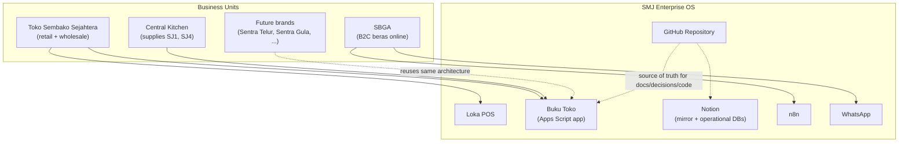
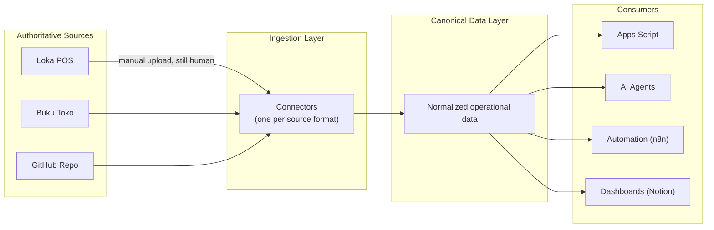
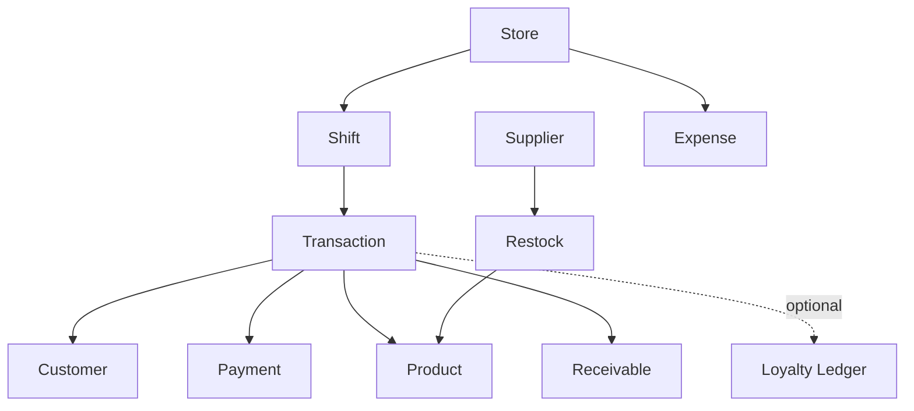
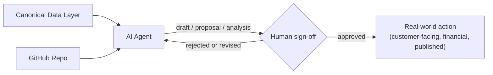
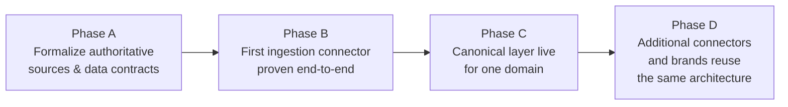

# SMJ Enterprise OS — Blueprint v1

| | |
| --- | --- |
| **Status** | Draft |
| **Date** | 31 July 2026 |
| **Scope** | Target architecture only — this is where the system is heading, not a record of what exists today or a plan for how to build it |
| **Builds on** | [ADR-0001](../adr/0001-github-authoritative-notion-mirror.md), [ADR-0002](../adr/0002-dana-ibu-adalah-modal-bukan-hutang.md), [ADR-0003](../adr/0003-canonical-data-platform-loka-pos.md), [ADR-0004](../adr/0004-technology-constitution-and-investment-principles.md) |

This document orients a new engineer joining the project: what the enterprise looks like, what systems are authoritative for what, how data is meant to flow, and where AI fits. It does not repeat the reasoning already recorded in the four ADRs above — it assumes you'll read those for *why*, and reads this for *what the target shape is*.

---

## 1. Enterprise Context

CV Sederhana Maju Jaya runs more than one business unit through a shared, growing set of systems. "SMJ Enterprise OS" is the name for that collective system — not one application, but the combination of a point-of-sale app, a custom operational tool, a code repository, a knowledge mirror, and automation glue, all serving multiple business lines at once.

The same architecture is meant to extend to future brands without being rebuilt per brand — that reusability is a design goal, not an accident.

---

## 2. Authoritative Systems

Per ADR-0003, exactly one system is authoritative per domain. No other system in the enterprise is a second source of truth for that domain — everything else is a consumer or a disposable surface.

| Domain | Authoritative system |
| --- | --- |
| Sales transactions | Loka POS |
| Operational records — cash custody, logistics, inventory, catalog, business workflows | Buku Toko (Google Sheets + Apps Script) |
| Code, decisions, documentation, specifications, automation scripts | GitHub Repository |

Everything not in this table — Notion, ad hoc spreadsheets, chat-delivered files — is a consumer of these systems, never a place new truth is allowed to originate.

---

## 3. Data Flow

Data moves in one direction: from authoritative sources, through an ingestion layer, into a canonical shape, out to whoever needs it. Nothing downstream writes back upstream.

The manual upload step (a person moving a file to Drive) stays human — this blueprint does not attempt to remove that. Everything after it is meant to be machine-driven and source-agnostic, per the Consumer Isolation Principle in ADR-0003: consumers read the canonical shape, never a source-native format.

---

## 4. Canonical Data Layer

The canonical layer holds one normalized view of the business, built from the authoritative sources above. It is described here by relationship, not by schema — field-level detail belongs in research documents (e.g. `research/loka-schema-analysis.md`), not in a blueprint meant to stay stable as sources change underneath it.

Each of these entities is a candidate concept, not a committed schema — the exact shape is deliberately left open until a canonical schema decision is made through its own process, consistent with ADR-0003 leaving "any specific code or schema change" undecided.

---

## 5. Automation Layer

Automation reacts to the canonical layer and to events at the edges of the system (a new lead, a new file in Drive, a cash discrepancy) — it does not hold its own copy of business truth. n8n is the current automation runtime; WhatsApp Business and GitHub Actions are the current channels automation acts through.

Automation is expected to grow in stages rather than all at once — starting with simple, low-risk notifications (e.g. "a lead hasn't been answered") before anything resembling autonomous response. How many stages exist and what each one does is an operational decision tracked in the backlog, not repeated here.

---

## 6. AI Workforce

AI agents sit alongside the canonical layer and the repository as a consumer that also produces drafts — research documents, proposed ADRs, backlog analysis, schema comparisons — but nothing an AI agent produces takes effect on its own.

This mirrors ADR-0004's AI Workforce Model principle directly: the agent proposes, drafts, and audits; a human approves anything with real-world consequence. That gate is architectural, not a courtesy — no path in this system is meant to let an AI agent's output reach a customer, a price, or a publish button without it.

---

## 7. Deployment Strategy

No specific hosting vendor is chosen in this document — that would be an implementation decision, and this blueprint is implementation-independent by design. What is fixed is the *shape* of the choice, per ADR-0004:

- Managed, pay-per-use services are the default for anything net-new; self-hosting is only chosen when a specific reason rules out a managed option.
- Whatever is chosen must have a stated exit path before it holds business data.
- No component may require a specific person's device to be powered on to keep functioning.

Where the canonical data layer itself will run, and which connector runs where, are open decisions — this blueprint describes the roles (source, connector, canonical layer, consumer), not the hosting choice for each role.

---

## 8. Technology Roadmap

This is a sequencing description, not a schedule — no dates, no task list. It exists to show *order*, per ADR-0004's Technology Investment Roadmap principle: technology work is sequenced behind business priority, not raced against it.

Each phase gates the next — Phase C doesn't start meaningfully until Phase B has proven a connector works with a real backup, and Phase D doesn't start until Phase C has something worth extending. This ordering follows the same discipline already applied to cash-custody and CK work in the operational backlog: one-time foundational work goes first and in sequence, not spread thin in parallel.

---

## 9. Guiding Principles

This blueprint is governed entirely by [ADR-0004 — Technology Constitution & Investment Principles](../adr/0004-technology-constitution-and-investment-principles.md). Every architectural choice above should trace back to one of its ten principles:

1. Business First
2. ROI First
3. Canonical Data
4. Laptop Independence
5. Managed Services Before Self-Hosting
6. Open Standards
7. Vendor Exit Strategy
8. AI Workforce Model
9. Technology Investment Roadmap
10. Decision Criteria Before Adopting New Software

See ADR-0004 for the full rationale behind each — this section intentionally does not restate it.

---

## 10. Out of Scope

This blueprint does not cover:

- Specific vendor or hosting selection for the canonical data layer or any connector
- Schema-level detail for any canonical entity (see research documents for that)
- A dated implementation timeline or task breakdown (see the operational backlog for active work)
- Central Kitchen pricing or recipe decisions (Ibu and Teh Nurul's authority, per ADR-0003)
- The status of Notion's operational databases (Lead Database, Content Pipeline, KPI Dashboard, Consultation Log) — left open by ADR-0001, still open here
- Brand-specific funnel, marketing, or channel design (SBGA specifics live in `ops/funnel/`)
- Cost estimates and platform comparisons (see `research/loka-ingestion-poc.md`)
- Security, compliance, or data-residency review — not yet performed for any part of this architecture
