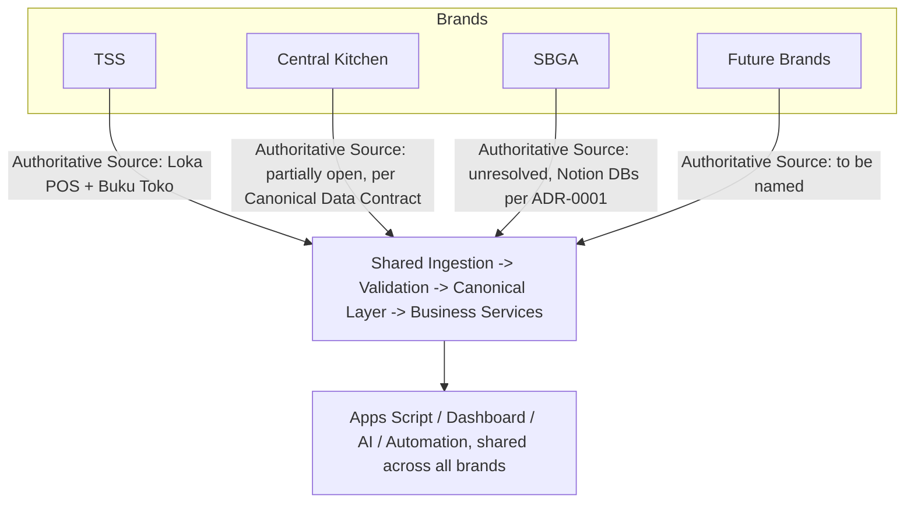
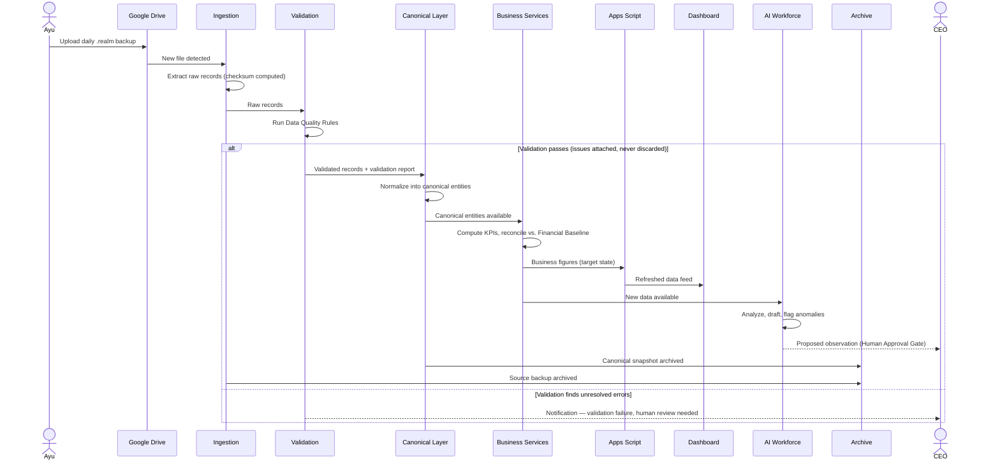

# Production Architecture v1 — SMJ Enterprise OS

| | |
| --- | --- |
| **Status** | Draft — proposed production architecture, pending CEO acceptance. Inherits the status of ADR-0003 and ADR-0004, both still Proposed. |
| **Date** | 31 July 2026 |
| **Proposed by** | Claude (agent), on behalf of no one — CEO decides |
| **Derives from** | `implementation/sprint-01.md`, `implementation/production-readiness-checklist.md`, `implementation/prototype-assumptions.md`, `implementation/implementation-backlog.md`, `implementation/dashboard-refactor-plan.md`, [Enterprise OS Blueprint v1](enterprise-os-blueprint-v1.md), [Canonical Data Contract v1](canonical-data-contract-v1.md), [Data Governance Framework v1](data-governance-framework-v1.md), [Enterprise KPI Framework v1](enterprise-kpi-framework-v1.md), [ADR-0003](../adr/0003-canonical-data-platform-loka-pos.md), [ADR-0004](../adr/0004-technology-constitution-and-investment-principles.md) |
| **Scope** | This document describes the target production architecture. It chooses no vendor, no cloud provider, no database, and implements nothing. |

---

## 1. Complete Production Architecture

```
Source Systems
     ↓
Ingestion
     ↓
Validation
     ↓
Canonical Layer
     ↓
Business Services
     ↓
Apps Script
     ↓
Dashboard
     ↓
AI
     ↓
Automation
     ↓
Archive
```

This extends the Blueprint's source → canonical → consumer flow with two pieces that prior documents named but never placed: **Business Services**, the layer where derived business meaning (KPIs, reconciliation against the Financial Baseline, the not-yet-built `summary` dataset) is computed once instead of separately inside Apps Script, the Dashboard, and any future AI analysis; and **Archive**, made an explicit terminal stage rather than an assumed property, because this project has already found one real instance of "not actually backed up" (commits sitting unpushed to `origin`, per the Data Governance Framework's Backup Policy).

`Automation` sits after `AI` in this diagram deliberately, not before it — automation in this architecture reacts to what Business Services and AI have already produced (a notification, a triggered refresh), it does not sit upstream deciding what canonical data should say. This is consistent with the Blueprint's own position that automation "does not hold its own copy of business truth."

---

## 2. Architectural Layers

The pipeline above is a flow. The five layers below are a different cut through the same system — which layer *owns* each stage, for accountability, not for sequencing.

| Layer | Contains | Owns |
| --- | --- | --- |
| **Governance Layer** | Data Governance Framework, Enterprise KPI Framework, ADR-0004's Technology Constitution, the Human Approval Gate | Not a stage in the pipeline — it constrains every other layer. Ownership, classification, lifecycle, and approval rules apply identically whether data is sitting in Ingestion or being read by AI. |
| **Data Layer** | Source Systems, Ingestion, Validation, Canonical Layer, Archive | Where data lives, moves, and is proven trustworthy before anything is built on top of it. |
| **Business Layer** | Business Services | Where canonical facts become business meaning — a KPI, a reconciled figure, a comparison against the Financial Baseline. This layer is stateless with respect to truth: it derives, it does not originate. |
| **Application Layer** | Apps Script, Dashboard, AI, Automation | Where business meaning reaches a human or reacts to an event. Nothing in this layer may compute its own parallel version of a figure Business Services already owns — this is the architectural fix for the `_bebanBulan()` / `_olahLoka()` duplication already found in the current Apps Script code. |
| **Infrastructure Layer** | Compute, storage, scheduling, networking — described only as requirements in §5 | Where everything above actually runs. No vendor is named anywhere in this document. |

Governance is drawn separately because it is not something data passes *through* once — it is a standing constraint every other layer must satisfy continuously (e.g., a canonical Customer record is always subject to the Personal-data classification rules, at every stage, not only when first ingested).

---

## 3. Components

Every component below states Purpose, Owner, Input, Output, Failure Mode, Recovery Strategy, Dependencies, and Future Scalability.

### 3.1 Source Systems

- **Purpose:** Hold business truth at the point closest to where it is created — exactly one Authoritative Source per domain (ADR-0003 §3): Loka POS (sales), Buku Toko (operations), GitHub (code/decisions).
- **Owner:** CEO, enterprise-wide; Ibu & Teh Nurul for Central Kitchen–specific operational facts.
- **Input:** Real business events — a sale, a physical count, a decision.
- **Output:** Source-native artifacts (`.realm` backups, the daily Loka JSON export, live Google Sheet data, git commits).
- **Failure Mode:** A source becomes unavailable, or its schema drifts without announcement — already observed directly (Loka's schema version changed from v105 to v109 between backups collected days apart).
- **Recovery Strategy:** Source-specific and, today, largely undocumented. GitHub has git's own distributed redundancy; Loka and Buku Toko have no formal recovery plan on record (Data Governance Framework §8 marks this UNKNOWN).
- **Dependencies:** None upstream — sources are the origin point by definition.
- **Future Scalability:** Each new brand needs its own named Authoritative Source per domain before it can be onboarded (see §4).

### 3.2 Ingestion

- **Purpose:** Translate one source-native format into the shape the Canonical Layer expects. "One connector per source format" (ADR-0003 §3) — Realm is the first, proven connector, not the model for all future ones.
- **Owner:** CEO (technical); no dedicated engineering role exists in this organization (Data Governance Framework §2).
- **Input:** A raw source artifact (e.g., a `.realm` file).
- **Output:** Raw extracted records, not yet canonical.
- **Failure Mode:** Source file missing, corrupt, or schema-drifted beyond what the connector was built against.
- **Recovery Strategy:** Retry on the next trigger; escalate to human notification after repeated failure, per the failure-scenario handling already designed (though not yet implemented) for the Loka connector.
- **Dependencies:** Source Systems must produce a readable artifact; a provenance/checksum registry (not yet built) to avoid reprocessing the same file.
- **Future Scalability:** New connectors (CSV, WhatsApp export, banking export) are added without changing the architecture itself — this is ADR-0003's stated design goal, not aspirational language.

### 3.3 Validation

- **Purpose:** Enforce the Data Quality Rules — Completeness, Consistency, Uniqueness, Integrity, Freshness, Traceability, Provenance (Data Governance Framework §7) — before anything becomes canonical.
- **Owner:** CEO defines the rules; the connector's validation stage enforces them.
- **Input:** Raw extracted records.
- **Output:** The same records, unmodified, plus a validation report. Records are **never discarded** for failing validation — this is already a proven, working property of the current prototype.
- **Failure Mode:** A rule set goes stale (e.g., an assumption about which fields are required no longer matches a drifted schema), or a new failure mode isn't covered by any existing rule.
- **Recovery Strategy:** Issues are reported for human review; whether unresolved errors should ever block export is a named, currently undecided policy (see Open Decisions).
- **Dependencies:** Ingestion (for raw records); a defined severity policy.
- **Future Scalability:** Rules defined per-entity in a shared registry, so new entities and new brands inherit a consistent validation pattern instead of bespoke logic each time.

### 3.4 Canonical Layer

- **Purpose:** The one normalized, provenance-tagged, versioned data layer every consumer reads from — never a source-native format (ADR-0003 §3, Consumer Isolation Principle).
- **Owner:** CEO overall; per-entity Business Owner as already assigned in the Canonical Data Contract and Data Governance Framework's Ownership Matrix.
- **Input:** Validated records.
- **Output:** Canonical entities (Product, Customer, Invoice, Shift, and so on) available to Business Services and, indirectly, every downstream consumer.
- **Failure Mode:** An entity's Authoritative Source conflict remains unresolved (Product, Shift, and Employee all currently have two competing sources, per the Canonical Data Contract), producing an ambiguous canonical record; or the layer becomes stale relative to its source.
- **Recovery Strategy:** Re-run ingestion from Archive'd source artifacts; reconcile specific entities (Receivables, Payables) against the Financial Baseline where one exists.
- **Dependencies:** Validation; Master Data governance definitions; the Financial Baseline as the historical reconciliation anchor.
- **Future Scalability:** This is the layer multi-brand reuse depends on most directly — the same entity shapes should serve every brand without redefinition (see §4).

### 3.5 Business Services

- **Purpose:** Compute derived business meaning from canonical data — KPIs (per the Enterprise KPI Framework), reconciliation against the Financial Baseline, and the not-yet-built figure that would finally reconcile Gross Margin, Net Margin, and `Invoice.profit` into one coherent, non-contradictory story.
- **Owner:** CEO.
- **Input:** Canonical entities.
- **Output:** Computed business figures, each traceable back to the canonical records and connector run that produced them.
- **Failure Mode:** A KPI's formula is undefined or applied inconsistently — the Enterprise KPI Framework already found that of 44 defined KPIs, only 2 (Opening Equity, Baseline Integrity) have a fully documented formula. This layer is exactly where that gap becomes actively dangerous if filled in ad hoc rather than deliberately.
- **Recovery Strategy:** This layer must be stateless with respect to truth — if a figure is wrong, the formula is fixed and the figure is recomputed from canonical data; the output is never hand-patched.
- **Dependencies:** Canonical Layer; the Enterprise KPI Framework's formula definitions (mostly still undefined — a named blocker, not an oversight of this document); the Financial Baseline.
- **Future Scalability:** The layer where multi-brand KPI *consistency* is actually enforced — "Gross Profit" means the same thing whether the data behind it is TSS, Central Kitchen, or SBGA.

### 3.6 Apps Script

- **Purpose:** Today's existing operational tool (Buku Toko). Currently both a live Authoritative Source (ADR-0003) and, in target state, a consumer of Business Services output rather than a second place where business logic is computed in parallel.
- **Owner:** CEO (technical); no dedicated engineering role.
- **Input:** Business Services output (target state); raw sheet data (current, unchanged state during transition).
- **Output:** The operational UI, the dashboard's data feed, cash-custody records.
- **Failure Mode:** Already documented directly, not hypothetically — sheets growing unbounded (`PATCH-01`'s own performance findings), and calculations silently diverging from canonical truth (the confirmed `kasAwal` asymmetry bug; `_bebanBulan()` never reading Loka's real Expense data).
- **Recovery Strategy:** Written fixes already exist for some of these (`TutupShiftV2.gs`) but are undeployed and untested. Broader recovery means migrating computation to Business Services incrementally, per the Dashboard Refactor Plan's classification and sequencing — not a rewrite in one step.
- **Dependencies:** Business Services (target state); the Google Sheets/Apps Script platform itself, which this document treats as a given, not a decision it makes.
- **Future Scalability:** As brands onboard, this layer should read the same Business Services outputs rather than reimplementing entity-specific logic per brand — the concrete mechanism for "no duplication."

### 3.7 Dashboard

- **Purpose:** Present business figures to a human. Holds no truth of its own — per the Canonical Data Contract's own distinction between canonical data and reports.
- **Owner:** CEO, as the primary consumer and decision-maker.
- **Input:** Business Services output (target state).
- **Output:** Visual/numeric display for human consumption.
- **Failure Mode:** Exactly what the dashboard lineage audit already found — cards with no verifiable source, a figure mislabeled as an achievement against the wrong target, cards whose rendering logic was never confirmed live.
- **Recovery Strategy:** Every card must be traceable through Business Services back to a canonical entity and its provenance. The lineage audit attempted this for 11 cards and could only fully verify 2 — recovery means closing that gap card by card, in the order the Dashboard Refactor Plan already sequenced.
- **Dependencies:** Business Services; Apps Script, as the current rendering mechanism unless and until redesigned.
- **Future Scalability:** A dashboard reading Business Services output generically (by KPI name, not brand-specific hardcoded logic) can display TSS, CK, or SBGA figures without a rebuild per brand.

### 3.8 AI (AI Workforce)

- **Purpose:** Read canonical and Business Services data to produce drafts, analysis, and proposals — never to originate canonical facts, never to act unsupervised on anything consequential (ADR-0004 Principle 8).
- **Owner:** CEO holds all approval authority. AI is never an owner of anything, in any layer, without exception.
- **Input:** Canonical data, Business Services output, the GitHub repo.
- **Output:** Draft documents, proposed analysis, flagged anomalies — always subject to human sign-off before anything consequential happens.
- **Failure Mode:** AI is fed stale or wrong Business Services output and produces confident, wrong analysis on top of it — the risk compounds exactly because AI output reads as authoritative even when its input wasn't.
- **Recovery Strategy:** The Human Approval Gate itself is the recovery mechanism, by design — nothing AI produces takes effect until a human catches an error first.
- **Dependencies:** Canonical Layer; Business Services; the GitHub repo.
- **Future Scalability:** The same AI Workforce governance applies unchanged across every brand — it is a policy pattern, not a per-brand integration.

### 3.9 Automation

- **Purpose:** React to canonical or business events (a new backup arrived, a validation failure occurred, a KPI crossed a defined threshold) without holding any copy of business truth of its own (per the Blueprint's Automation Layer).
- **Owner:** CEO; no dedicated technical role.
- **Input:** Events from Ingestion, Validation, the Canonical Layer, and Business Services.
- **Output:** Notifications; triggered downstream actions (e.g., prompting a Dashboard refresh).
- **Failure Mode:** A trigger fails silently — this is the single most repeated failure pattern in this project's entire history: Windows Task Scheduler, the `Rekonsiliasi` sheet stalling with nothing downstream aware, push-notification channels expiring unrenewed.
- **Recovery Strategy:** Every automated step must itself be observable. A missing expected event ("no backup arrived today") must be detectable and distinguishable from "nothing happened" — a design requirement this architecture states explicitly, not yet an implemented capability anywhere in this project.
- **Dependencies:** Everything upstream in the pipeline; a Notification mechanism, not yet built.
- **Future Scalability:** Automation rules ("notify on validation failure") are defined once and apply to every onboarded brand automatically, never re-authored per brand.

### 3.10 Archive

- **Purpose:** Retain source artifacts and canonical records permanently, per the Never Deleted / Immutable History principle already proven in the Financial Baseline.
- **Owner:** CEO.
- **Input:** Source artifacts (from Ingestion) and canonical records (from the Canonical Layer), at every processing run.
- **Output:** A permanent, queryable history — the record of what was known, and when.
- **Failure Mode:** Archival is skipped under storage or cost pressure, or archived data isn't actually retrievable when needed — an untested recovery path is not a recovery path. This project has already found a live instance of the underlying risk: commits sitting unpushed to `origin` at multiple points, meaning they were not yet durably archived at all.
- **Recovery Strategy:** Archive **is** the recovery strategy for everything upstream of it — it has no further fallback, which is exactly why its own integrity cannot be assumed.
- **Dependencies:** Ingestion; Canonical Layer.
- **Future Scalability:** One retention policy applied uniformly across brands — archiving TSS data is not structured differently than archiving SBGA data.

---

## 4. Multi-Brand Design

**No new pipeline is built per brand.** Onboarding a brand means three things, and only three:

1. Name its Authoritative Source(s) per canonical entity domain (many are already named for TSS; Central Kitchen and SBGA both have explicitly open items in the Canonical Data Contract §4 — this document does not resolve them, it shows where that resolution plugs in).
2. Assign a Business Owner and Technical Owner, consistent with the Data Governance Framework's Ownership Matrix pattern.
3. Extend the canonical model only if the brand introduces a genuinely new business concept with no existing analog — through the Canonical Data Contract's own additive versioning path (§9), never by forking the pipeline.



A brand that cannot yet name its Authoritative Source is not onboarded — that is a decision gate, not a technical limitation, and it applies today to both Central Kitchen and SBGA exactly as much as it would to any brand not yet named.

---

## 5. Deployment Principles

No vendor, cloud provider, or database is named anywhere in this section — only requirements a future implementation must satisfy.

- **Laptop independence is mandatory** (ADR-0004 Principle 4). No component in the Data, Business, or Application layers may require a specific person's device to be powered on.
- **Managed, pay-per-use services are the default** for anything net-new (ADR-0004 Principle 5); self-hosting is chosen only when a specific, stated reason rules out a managed option.
- **Every adopted service must have a documented exit path** before it holds business data (ADR-0004 Principle 7) — "how do we get our data out, and how do we replace this" must be answerable in writing, not assumed.
- **Data residency and classification must be honored by construction.** Personal- and Financial-classified data (Data Governance Framework §3) must never transit or land in infrastructure that hasn't been evaluated against those classifications — this is a requirement on any future vendor choice, not a vendor choice itself.
- **Every deployed change must be reversible.** A new version of any component must not silently replace the working one without a documented way back — consistent with this project's own Rollback Strategy already established for the prototype (Sprint 01).
- **Cost must scale with actual usage, not with fixed overhead** disproportionate to a small business's actual size (ADR-0004 Principle 2, ROI First). A architecture that costs more to run idle than the business it serves generates in profit has failed this principle regardless of its technical merits.

---

## 6. Event Flow

```
New Loka Backup
     ↓
Validation
     ↓
Canonical Update
     ↓
Apps Script Refresh
     ↓
Dashboard Refresh
     ↓
AI Notification
     ↓
Archive
```

A new backup arriving is the single most common event this architecture must handle correctly, end to end, without a human in the loop past the initial upload (per `research/loka-ingestion-poc.md`'s already-researched target). Validation runs before anything is trusted; the Canonical Layer only updates on a validation pass (with issues attached, never silently dropped); Apps Script and the Dashboard refresh from the updated canonical/Business Services data, not from the raw backup directly; AI is notified of the update as a consumer, and may produce a proposed observation (e.g., "Gross Margin moved by more than usual this week") subject to the same Human Approval Gate as everything else; Archive closes the loop by retaining both the source backup and the resulting canonical state permanently.

---

## 7. Sequence Diagram



---

## 8. Non-Functional Requirements

- **Availability:** The pipeline must function independent of any single person's device being on (ADR-0004 Principle 4). Target: Ingestion and the Canonical Layer are available regardless of any specific machine's state.
- **Maintainability:** Adding a new entity or onboarding a new brand must require touching a bounded, documented set of places — the same standard already set for the prototype refactor (Sprint 01's "one place, not three" acceptance criterion), generalized to the whole architecture.
- **Scalability:** Must handle growth in transaction volume, entity count, and brand count without redesign. Validated only at prototype scale (481 invoices, ~1 MB backup) — not yet tested at meaningfully larger scale, a named gap, not an assumed capability.
- **Security:** Personal- and Financial-classified data must never leave governed storage ungoverned. Credentials (e.g., `Cashier.pin`) must never enter the Canonical Layer at all — already a proven, working rule in the prototype, and a requirement here at the architecture level, not an implementation detail.
- **Auditability:** Every canonical fact must be traceable to its source event and connector run (the Provenance requirement, already implemented). Every Business Services figure must, in addition, be traceable to the canonical facts *and the formula version* that produced it — this second half does not exist yet, since Business Services itself does not exist yet.
- **Recoverability:** Every component's failure must be observable, never silent, and every processing step must be re-runnable from Archive.
- **Performance:** Must process a daily backup within a bounded time window before the next business day begins. No specific numeric target is set in this document — see Open Decisions.
- **Cost Awareness:** Cost must scale with actual usage; no component may incur cost disproportionate to a small business's current scale, regardless of technical elegance (ADR-0004 Principles 2 and 5).

---

## 9. Production Readiness Matrix

| Capability | Prototype | Production Target | Gap | Priority |
| --- | --- | --- | --- | --- |
| Entity extraction | 8 entities, hardcoded in 3 places, verified against a real backup | Config-driven registry supporting N entities, one place to edit | Hardcoded entity lists in `config.js`, `normalize.js`, `validate.js` | P0 |
| Validation | 8 required categories implemented and independently tested | Same, plus a defined severity policy and run-level (batch) sanity checks | No severity policy exists; only record-level checks | P0 |
| Schema drift detection | None — flagged as a TODO in the prototype's own code | Automated comparison against a documented last-known-good version | Not implemented | P0 |
| Automated testing | Zero — verification was ad hoc and left no permanent artifact | Full automated suite covering all 8 validation categories and parser edge cases | No test suite exists | P0 |
| Business Services layer | Does not exist | Computes the Enterprise KPI Framework's 44 KPIs; only 2 currently have a confirmed formula | Almost entirely unbuilt | P0 |
| Error handling | Plain `Error` objects, string messages only | Typed/coded errors distinguishable by callers | No error types exist | P1 |
| Logging | `console.log` only, no levels or run ID | Structured, leveled, run-ID-tagged logging | No structure at all | P1 |
| Provenance / dedup registry | Checksum computed per run, never stored or compared | Persistent registry preventing reprocessing of the same file | Not implemented | P1 |
| Canonical entity coverage | 8 of the entities named in the Canonical Data Contract | Full coverage, including Receivables, Stock Alerts, and a still-undefined Goods Out entity | 3+ entities missing entirely | P1 |
| Deployment / hosting | Local developer machine only, manual invocation | Laptop-independent, managed-service hosting | No hosting decision made — deliberately out of scope until ADR-0003 is accepted | P1 |
| Governance enforcement | Documented on paper (Data Governance Framework) | The same ownership, classification, and retention rules enforced by the running system, not only written down | Policy exists; no running check enforces it yet | P1 |
| Multi-brand support | TSS only, via Loka | TSS + Central Kitchen + SBGA + future brands on one shared pipeline | CK and SBGA Authoritative Sources are unresolved | P2 |
| Human Approval Gate | Stated as policy (ADR-0004); nothing exists yet for it to gate | An enforced checkpoint before any AI- or automation-driven consequential action | Not implemented — becomes P0 the moment automation gains any write capability | P2 |

---

## 10. Closing

### Open Decisions

- Whether the `Ringkasan` cache is computed from the `.realm` backup or the separate daily JSON export — the single highest-leverage unresolved question, affecting four dashboard cards at once (per the Lineage Audit).
- The validation severity policy: does an unresolved 'error'-severity issue block Canonical Layer updates, or only get flagged?
- Central Kitchen and SBGA's Authoritative Source assignments.
- A numeric performance target for "how fast must a daily run complete."
- Whether the still-unresolved porsi modal (Aditya vs. Ibu capital split, per ADR-0002) affects any Business Services calculation touching Equity.

### Future ADRs Required

- Formal CEO acceptance, rejection, or amendment of **ADR-0003 and ADR-0004** — this entire document's premise depends on it, stated plainly rather than assumed.
- A new ADR resolving the Product, Shift, and Employee Authoritative Source conflicts once a decision is made.
- A new ADR (or extension of ADR-0003) bringing Central Kitchen and SBGA into the Authoritative Sources model.
- A new ADR resolving the Notion operational-database question, already deferred once by ADR-0001.

### Known Risks

- The Realm SDK ecosystem is community-maintained only, with no commercial vendor obligated to track future Loka schema changes (`research/loka-ingestion-poc.md`).
- A single-person bottleneck (the CEO) governs both business decisions and all technical work — named as an active risk since Roadmap v6 and unchanged since.
- No tested recovery path exists for any component in this architecture today — every "Recovery Strategy" above is a stated design, not yet a proven capability.
- The Business Services layer does not exist, meaning every KPI in the Enterprise KPI Framework remains "Proposed" or "Unknown" — this architecture's own Business Layer is currently the least mature part of the whole system.

### Success Criteria

- A new Loka backup flows from arrival to Dashboard-visible, correctly labeled figures without manual intervention, with every figure traceable to its source.
- Onboarding a second brand (Central Kitchen or SBGA) requires no pipeline redesign — only new Authoritative Source mappings and Business Owner assignments.
- Zero dashboard cards remain in unresolved lineage status — today, 9 of the 11 cards audited have at least one unverified link in their chain; production readiness means that number is zero, not merely smaller.
