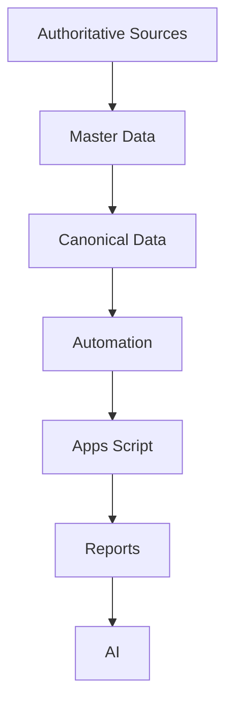

# Canonical Data Layer

| | |
| --- | --- |
| **Status** | Draft — governance definition only, pending CEO acceptance |
| **Date** | 31 July 2026 |
| **Scope** | Defines the Canonical Data Layer for ten datasets. Contains no ingested data, no schemas, no code. |
| **Derives from** | [ADR-0003](../../adr/0003-canonical-data-platform-loka-pos.md), [ADR-0004](../../adr/0004-technology-constitution-and-investment-principles.md), [Enterprise OS Blueprint v1](../../architecture/enterprise-os-blueprint-v1.md), [Canonical Data Contract v1](../../architecture/canonical-data-contract-v1.md), [Data Governance Framework v1](../../architecture/data-governance-framework-v1.md), [Enterprise KPI Framework v1](../../architecture/enterprise-kpi-framework-v1.md), [Enterprise Master Data README](../master/README.md), [2026-07-31 Baseline Manifest](../baseline/2026/2026-07-31-reset/MANIFEST.md), [`loka-schema-analysis.md`](../../research/loka-schema-analysis.md) |

---

## Why Canonical Data Exists

ADR-0003 already diagnosed the problem this layer solves: five places — Loka POS, the Buku Toko sheet, the GitHub repo, Notion, and ad hoc spreadsheets — can each originate business truth today, with no declared rule for which one wins. `loka-schema-analysis.md` shows exactly how this plays out inside a single source: Loka's own data model uses three different, easily-confused relationship mechanisms (true links, embedded snapshots, soft string references), and a figure as basic as "profit" already has three independent, unreconciled answers — Gross Margin, Net Margin, and `Invoice.profit`.

The Canonical Data Layer exists to give every consumer — Apps Script, automation, reports, AI — exactly one normalized shape to depend on, built once from the Authoritative Sources and Master Data, so that fixing a disagreement happens in one place instead of being silently re-litigated inside every system that touches the data.

## Why Apps Script Must Never Read Source-Native Formats

This is the Consumer Isolation Principle, stated directly in ADR-0003 §3: consumers depend on the canonical shape, never on a source system's native format. Loka's own schema has already drifted once during research (`v105` → `v109` across backups collected days apart, per `loka-schema-analysis.md`). If Apps Script read `.realm` structure directly, that drift would ripple straight into its logic with no buffer. Reading canonical data instead means a source format change is absorbed once, at the ingestion connector, and never has to be handled twice.

## Why AI Reads Canonical Data Only

The same Consumer Isolation Principle applies to AI, reinforced by the AI Workforce Model (ADR-0004 Principle 8): an AI agent's output is only as reliable as its input, and Loka's source data contains exactly the kind of subtlety — three different relationship mechanisms that all look alike, a `Product.category` snapshot that can legitimately disagree with the current category master — that an AI agent has no reliable way to interpret correctly on the fly. Canonical data is where those interpretive decisions have already been made once, deliberately, and recorded. AI reads that settled shape, proposes from it, and everything consequential still passes through a human approval gate before it acts.

## How Canonical Data Differs from Master Data

[Master Data](../master/README.md) defines the **rules** — who owns a Product, what its lifecycle is, whether it can be deleted, what its Authoritative Source is supposed to be. Canonical Data is the **actual normalized record** produced by applying those rules to real ingested data. Master Data can exist, as it does today, entirely as governance with zero records behind it. Canonical Data cannot exist until ingestion actually happens — and several of the datasets in this directory (Inventory, Payments, Summary) don't yet have a confirmed authoritative path to become canonical at all, which is stated plainly in each file rather than assumed away.

Canonical Data also covers ground Master Data does not: transactional and event data — Sales, Payments, Shifts, Restocks — that describe things that *happened*, not stable reference entities that simply *exist*.

## How Canonical Data Differs from the Financial Baseline

The [2026-07-31 baseline](../baseline/2026/2026-07-31-reset/MANIFEST.md) is one immutable, physically-verified, point-in-time snapshot. It is never recalculated and never absorbs new transactions. Canonical Data is the opposite in kind: an ongoing layer that changes as new source data is ingested. The relationship between the two is one of reconciliation, not equivalence — per the Manifest's own Reconciliation Rule, every financial report from 1 August 2026 onward must be traceable back to the baseline, and Canonical Data (specifically the `summary` dataset) is where that reconciliation would actually be performed, if built. Several datasets in this layer (Inventory, Receivables, Payables via Restocks) already have a parallel, *unreconciled* relationship with the baseline today — this is named explicitly in each file, not smoothed into a false agreement.

## How Canonical Data Differs from Reports

Canonical Data is the normalized source layer. Reports are a downstream consumer that reads canonical data — most directly the `summary` dataset — to present it to a human. Reports hold no truth of their own; they visualize or narrate what is already canonical. A number that appears in a report and cannot be traced back to a canonical dataset is not yet trustworthy by this framework's own standard.

---

## The Ten Canonical Datasets

| Dataset | What it normalizes |
| --- | --- |
| [Sales](sales.md) | Every completed transaction |
| [Products](products.md) | The canonical, ingested product catalog |
| [Inventory](inventory.md) | Stock quantity on hand |
| [Customers](customers.md) | Canonical customer accounts, including the Branch-as-Customer overlap |
| [Payments](payments.md) | Payment method and amount per transaction |
| [Receivables](receivables.md) | Amounts owed to the business |
| [Expenses](expenses.md) | Operating costs |
| [Restocks](restocks.md) | Stock-in / purchasing activity |
| [Shifts](shifts.md) | Cashier work periods with cash counts |
| [Summary](summary.md) | Derived rollup metrics — where Gross Margin, Net Margin, and reconciliation to the baseline would actually be computed |

Every file states, without exception, wherever today's nine source documents do not establish an answer.

---

## Data Flow

AI sits at the end of this chain as a consumer only — never an owner, and never a step that data flows *through* on its way to becoming canonical.
