# Business Rules Catalog v1

| | |
| --- | --- |
| **Status** | Draft — proposed enterprise business-rules catalog, pending CEO acceptance. Inherits the status of every document it draws from — ADR-0003, ADR-0004, and every architecture/services document are themselves still Proposed/Draft. |
| **Date** | 1 August 2026 |
| **Compiled by** | Claude (agent), on behalf of no one — CEO decides |
| **Compiled strictly from** | [ADR-0001](../adr/0001-github-authoritative-notion-mirror.md)–[0004](../adr/0004-technology-constitution-and-investment-principles.md), [Enterprise OS Blueprint v1](../architecture/enterprise-os-blueprint-v1.md), [Canonical Data Contract v1](../architecture/canonical-data-contract-v1.md), [Data Governance Framework v1](../architecture/data-governance-framework-v1.md), [Enterprise KPI Framework v1](../architecture/enterprise-kpi-framework-v1.md), [Production Architecture v1](../architecture/production-architecture-v1.md), [Service Boundary Review](../architecture/service-boundary-review.md), all six documents in [`services/`](../services/README.md), the [2026-07-31 Baseline Manifest](../enterprise-data/baseline/2026/2026-07-31-reset/MANIFEST.md), the [Dashboard Reconciliation Audit](../reports/dashboard-reconciliation-audit.md), the [Dashboard Refactor Plan](../implementation/dashboard-refactor-plan.md), and the [Implementation Backlog](../implementation/implementation-backlog.md) |

Wherever this catalog states a rule, it names the document it came from. Wherever no document defines something a rule would need, the field says **UNKNOWN** — nothing here is invented to fill a gap.

---

# 1. Purpose

Every prior document in this repository states rules incidentally — inside an ADR's Decision section, inside a Canonical Entity's Ownership Matrix row, inside a bug-fix's Acceptance Criteria. None of them exist to be *the* place a future automation, AI agent, Apps Script function, dashboard card, report, or Business Service checks before acting. This catalog is that place: every rule already decided or proposed somewhere in this repository, gathered into one document, so that "does this action violate an existing rule" has one place to look instead of eleven.

**Why Business Rules exist, specifically:** this project has already found, and documented, real instances of what happens without them — a dashboard showing Gross Profit labeled as an achieved Net target (`reports/dashboard-reconciliation-audit.md`), a cash-custody figure carried forward incorrectly for an unknown period (`implementation/implementation-backlog.md`, BL-003), and a code comment asserting expenses "aren't tracked anywhere" while Rp18.5 million in expense data sat unread in the same backup (same audit). None of these were failures of technology. They were failures of a rule not being written down somewhere every consumer was required to check.

## Policy vs. Business Rule vs. Technical Rule vs. Validation Rule

These four terms are used loosely and interchangeably elsewhere in this repository's documents. This catalog draws the boundary explicitly, because conflating them is exactly the kind of ambiguity a rules catalog exists to remove:

- **Policy** — a standing, constitutional-level directive about how the organization behaves across many future situations, not tied to a specific transaction or figure. Example: "Managed Services Before Self-Hosting" (ADR-0004 Principle 5). A policy shapes *decisions*, not *data*.
- **Business Rule** — a rule that governs a specific business fact, calculation, or permitted action, grounded in what the business actually needs to be true. Example: "Ibu's funds in TSS are capital, not debt" (ADR-0002). A business rule shapes *meaning* — what a number or record is allowed to represent.
- **Technical Rule** — a rule that governs how systems represent, move, or protect data in service of a business rule, without being business meaning itself. Example: "`Cashier.pin` must never enter the Canonical Layer" (Data Governance Framework §3). A technical rule protects a business rule; it doesn't originate one.
- **Validation Rule** — a rule that checks whether data is well-formed or internally consistent *before* it is trusted, independent of what it means. Example: the seven Data Quality Rules — Completeness, Consistency, Uniqueness, Integrity, Freshness, Traceability, Provenance (Data Governance Framework §7). A validation rule answers "is this data trustworthy," not "what does it mean" or "what may be done with it."

This catalog contains primarily **Business Rules**, with **Policy** rules included where a policy directly constrains business behavior (Section 3, Governance subsection) and **Security**/**Technical** rules included where they directly protect a named business fact (Section 3, Security subsection). Pure implementation-level technical rules (how a connector parses a field, how a database indexes a table) are out of scope — none appear here, and none should.

---

# 2. Rule Classification

Every rule in this catalog is grouped into exactly one of eleven categories. Two of them — **Governance** and **Security** — have no dedicated numbered section in this document's required structure (Sections 4–12 name only Financial, Inventory, Sales, Pricing, Customer, Supplier, AI, Automation, Reporting). Per the structure given, Governance and Security rules are catalogued in full within **Section 3** instead, immediately below, rather than inventing a new top-level section number.

| Category | Rule count | Where catalogued |
| --- | --- | --- |
| Governance | 9 | Section 3 |
| Security | 4 | Section 3 |
| Financial | 10 | Section 4 |
| Inventory | 7 | Section 5 |
| Sales | 7 | Section 6 |
| Pricing | 4 | Section 7 |
| Customer | 4 | Section 8 |
| Supplier | 4 | Section 9 |
| AI | 6 | Section 10 |
| Automation | 4 | Section 11 |
| Reporting | 5 | Section 12 |
| **Total** | **64** | |

---

# 3. Business Rule Catalog

Every rule below — in this section and Sections 4–12 — follows the same fifteen-field format:

**Rule ID · Rule Name · Description · Business Reason · Trigger · Applies To · Inputs · Outputs · Owner · Approval Required · Priority · Current Status · Authoritative Source · Dependencies · Exceptions · Known Gaps**

Where a field has no answer in any of the fifteen source documents, it reads **UNKNOWN**. Where a rule is declarative (governs meaning, not a computed event), Trigger/Inputs/Outputs read **N/A — declarative rule, not computed**, rather than a fabricated technical shape.

## Governance Rules

### GOV-001 — Single Source of Truth Per Domain
1. **Description:** Exactly one system is authoritative per business domain; every other system is a consumer or disposable surface.
2. **Business Reason:** Five systems previously held overlapping, unranked truth with no rule for which one wins when they disagree (ADR-0003 §2).
3. **Trigger:** N/A — declarative rule, not computed.
4. **Applies To:** Every canonical entity and domain.
5. **Inputs:** N/A.
6. **Outputs:** N/A.
7. **Owner:** CEO.
8. **Approval Required:** N/A — constitutional rule, not a per-instance action.
9. **Priority:** Foundational — every other rule in this catalog assumes it.
10. **Current Status:** **Proposed** (ADR-0003 not yet Accepted).
11. **Authoritative Source:** ADR-0003 §3 (Loka POS = sales; Buku Toko = operations; GitHub = code/decisions).
12. **Dependencies:** None upstream.
13. **Exceptions:** Product, Shift, and Employee currently violate this rule today — see INV-002/003, SAL-001, SAL-007.
14. **Known Gaps:** Central Kitchen and SBGA have no resolved Authoritative Source assignment yet (Production Architecture §10).

### GOV-002 — Consumer Isolation Principle
1. **Description:** Consumer applications (Apps Script, AI, automation, dashboards, reports) never depend on a source system's native format — only on the Canonical Layer's definitions.
2. **Business Reason:** A source format change must never ripple downstream and silently break a consumer.
3. **Trigger:** N/A — declarative.
4. **Applies To:** All consumers, all entities.
5. **Inputs:** N/A. 6. **Outputs:** N/A.
7. **Owner:** CEO.
8. **Approval Required:** N/A.
9. **Priority:** Foundational.
10. **Current Status:** **Proposed** (depends on ADR-0003).
11. **Authoritative Source:** ADR-0003 §3; Canonical Data Contract §2.
12. **Dependencies:** GOV-001.
13. **Exceptions:** None documented.
14. **Known Gaps:** No running system currently enforces this — it is a written rule with no operating consumer yet (Production Architecture §9).

### GOV-003 — Immutable History / Never Deleted
1. **Description:** Once a fact is canonical, it is never silently rewritten. A correction is a new, dated, additive fact.
2. **Business Reason:** Proven in practice by the 2026-07-31 Financial Baseline; generalized to all canonical data.
3. **Trigger:** A correction to an existing canonical fact is needed.
4. **Applies To:** All canonical entities, especially Financial and Baseline Snapshot.
5. **Inputs:** The prior fact plus the correcting fact. 6. **Outputs:** A new dated record; the old one unchanged.
7. **Owner:** CEO.
8. **Approval Required:** Yes — creation of a new correcting fact (Canonical Data Contract §6, Baseline Snapshot row).
9. **Priority:** Foundational.
10. **Current Status:** **Implemented** for the Financial Baseline specifically (MANIFEST.md, CHANGELOG.md pattern); **Proposed** for all other canonical data.
11. **Authoritative Source:** MANIFEST.md, Integrity Rules; Canonical Data Contract §2, §7; Data Governance Framework §4.
12. **Dependencies:** GOV-001.
13. **Exceptions:** Data Governance Framework §4 marks a possible legal/regulatory override (e.g. a data-subject deletion request) as **UNKNOWN** — not addressed by any ADR.
14. **Known Gaps:** Retention period for lower-tier operational logs (e.g. Automation Job records) is UNKNOWN (Data Governance Framework §4).

### GOV-004 — Human Approval Gate
1. **Description:** Nothing an AI agent or automation produces takes effect on anything consequential — money, customer communication, published content — without a named human approving it first.
2. **Business Reason:** AI is a workforce multiplier, not a replacement for judgment on consequential matters.
3. **Trigger:** Any AI- or automation-produced output that would have real-world consequence.
4. **Applies To:** All entities; all AI and Automation rules inherit this directly.
5. **Inputs:** A draft/proposal/flagged action. 6. **Outputs:** An approved or rejected action.
7. **Owner:** CEO (sole approval authority — no dedicated technical role exists, ADR-0004 Principle 5).
8. **Approval Required:** Yes — this rule *is* the approval requirement.
9. **Priority:** Foundational.
10. **Current Status:** **Proposed** as policy (ADR-0004); **Unknown** whether any running system currently enforces it mechanically (Production Architecture §9: "stated as policy; nothing exists yet for it to gate").
11. **Authoritative Source:** ADR-0004 Principle 8; Canonical Data Contract §2.
12. **Dependencies:** None upstream.
13. **Exceptions:** None — stated as absolute in every source document that names it.
14. **Known Gaps:** No AI Session record exists yet to make "did a human approve this" auditable (Canonical Data Contract §4).

### GOV-005 — No Duplicate Meaning
1. **Description:** Two systems computing "profit" differently, or two tables both claiming to be the record of the same fact, is a defect to be named and resolved — not a tolerated steady state.
2. **Business Reason:** The standing, unresolved example already on record: Gross Margin, Net Margin, and `Invoice.profit` are three different figures for what is colloquially the same question (ADR-0003 §2).
3. **Trigger:** N/A — declarative. 4. **Applies To:** Every canonical entity and figure.
5. **Inputs:** N/A. 6. **Outputs:** N/A.
7. **Owner:** CEO.
8. **Approval Required:** N/A.
9. **Priority:** High.
10. **Current Status:** **Proposed** — the violation it targets (Gross/Net/`Invoice.profit`) remains unreconciled today.
11. **Authoritative Source:** Canonical Data Contract §2.
12. **Dependencies:** GOV-001.
13. **Exceptions:** None.
14. **Known Gaps:** No mechanism enforces this beyond written policy — see `service-boundary-review.md` Finding O2, which names the identical gap at the Business Service layer.

### GOV-006 — Explicit Ownership Required
1. **Description:** Every canonical entity must have a named Business Owner. "Nobody's clearly in charge of this data" is not a permitted state.
2. **Business Reason:** Ambiguous ownership is how conflicting truths persist undetected.
3. **Trigger:** N/A — declarative. 4. **Applies To:** All 19 canonical entities.
5. **Inputs:** N/A. 6. **Outputs:** An Ownership Matrix row.
7. **Owner:** CEO. 8. **Approval Required:** N/A.
9. **Priority:** Foundational.
10. **Current Status:** **Implemented** as a document (Canonical Data Contract §6, Data Governance Framework §2) — every entity does have a listed owner.
11. **Authoritative Source:** Canonical Data Contract §2, §6.
12. **Dependencies:** None. 13. **Exceptions:** None.
14. **Known Gaps:** UNKNOWN whether Central Kitchen Approval Authority sits with Ibu alone, Teh Nurul alone, or jointly (Data Governance Framework §2, explicitly marked UNKNOWN there).

### GOV-007 — Reversal Discipline
1. **Description:** Reversing a prior decision requires a new, explicit document that names the one it changes. No document may silently contradict an earlier one.
2. **Business Reason:** This exact failure already happened once — the CEO Memo (24 Jul) vs. SOP TSS (27 Jul) contradiction, undetected until a manual audit (ADR-0001).
3. **Trigger:** Any decision that changes a prior one. 4. **Applies To:** ADRs, governance documents, the Canonical Data Contract, business rules in this catalog.
5. **Inputs:** The prior decision. 6. **Outputs:** A new document naming it.
7. **Owner:** CEO. 8. **Approval Required:** Yes, inherently (the new document is itself the approval record).
9. **Priority:** Foundational.
10. **Current Status:** **Implemented** — ADR-0001 and ADR-0002 both already follow this pattern in practice.
11. **Authoritative Source:** ADR-0001, ADR-0002; Canonical Data Contract §9; Data Governance Framework §6.
12. **Dependencies:** None. 13. **Exceptions:** None.
14. **Known Gaps:** No automated check enforces this for business rules specifically (only for ADRs and roadmap documents, via `automation/validate.mjs`, which is outside this catalog's fifteen-document scope).

### GOV-008 — Technology Constitution (Ten Investment Principles)
1. **Description:** Business First, ROI First, Canonical Data, Laptop Independence, Managed Services Before Self-Hosting, Open Standards, Vendor Exit Strategy, AI Workforce Model, Technology Investment Roadmap, and a Decision Criteria checklist before adopting new software.
2. **Business Reason:** Each principle exists because an ad hoc technology decision already cost something (ADR-0004 Purpose: Notion-as-repo, five unranked sources, an undocumented database-vendor risk).
3. **Trigger:** Any new technology, vendor, or architecture proposal. 4. **Applies To:** All future technology decisions, enterprise-wide.
5. **Inputs:** A technology proposal. 6. **Outputs:** A pass/fail against the ten-point checklist (ADR-0004 §10).
7. **Owner:** CEO (sole decision authority). 8. **Approval Required:** Yes — passing the checklist does not itself constitute approval.
9. **Priority:** Foundational.
10. **Current Status:** **Proposed** (ADR-0004 not yet Accepted).
11. **Authoritative Source:** ADR-0004, all ten principles.
12. **Dependencies:** None upstream; every other rule in this catalog is checked against it (ADR-0004, "How This ADR Is Used").
13. **Exceptions:** None stated. 14. **Known Gaps:** No vendor has yet been evaluated against this checklist in practice — untested as an operating rule.

### GOV-009 — GitHub as Source of Truth, One-Way Sync to Notion
1. **Description:** GitHub is the sole source of truth for decisions, roadmap, SOPs, and code. Notion is a read-only mirror, synced one-way (`repo → Notion`); Notion pages targeted by the mirror are overwritten on sync.
2. **Business Reason:** Notion previously allowed contradictory memos to coexist undetected, and had no scheduler, no reviewable versioning, and could not run code (ADR-0001).
3. **Trigger:** A scheduled or manual sync run. 4. **Applies To:** All documentation and decision records.
5. **Inputs:** Repository Markdown files. 6. **Outputs:** Updated Notion mirror pages.
7. **Owner:** CEO. 8. **Approval Required:** No for the sync itself (automated); Yes for any content change before it syncs (it's already CEO-approved by virtue of being committed).
9. **Priority:** Foundational. 10. **Current Status:** **Implemented** (GitHub Actions, `NOTION_TOKEN` secret, per ADR-0001).
11. **Authoritative Source:** ADR-0001. 12. **Dependencies:** None.
13. **Exceptions:** Notion's separate operational databases (Lead Database, Content Pipeline, KPI Dashboard, Consultation Log) are explicitly out of this rule's scope and remain read-write (ADR-0001).
14. **Known Gaps:** The status of those operational databases is still unresolved, deferred to a future ADR (ADR-0001, "Yang belum diputuskan").

## Security Rules

### SEC-001 — Credentials Must Never Enter the Canonical Layer
1. **Description:** No credential (e.g. `Cashier.pin`) may be normalized into canonical data, at any stage.
2. **Business Reason:** A plaintext credential in an otherwise business-meaning-focused canonical layer is a direct security exposure with no business value.
3. **Trigger:** Any ingestion connector encountering a credential-shaped field.
4. **Applies To:** Employee/Cashier entity, any future entity with an authentication field.
5. **Inputs:** Raw source record. 6. **Outputs:** A canonical record with the credential field excluded.
7. **Owner:** CEO (no dedicated technical role). 8. **Approval Required:** No — this is a hard exclusion rule, not a case-by-case decision.
9. **Priority:** Critical.
10. **Current Status:** **Implemented** — "already a proven, working rule in the prototype" (Production Architecture §8, NFR: Security).
11. **Authoritative Source:** Data Governance Framework §3 (Confidential classification); Production Architecture §8.
12. **Dependencies:** SEC-002. 13. **Exceptions:** None.
14. **Known Gaps:** None documented for this rule specifically.

### SEC-002 — Data Classification Scheme
1. **Description:** Every canonical entity and artifact is classified as one of: Public, Internal, Confidential, Financial, Strategic, Personal, or Operational — not mutually exclusive.
2. **Business Reason:** Different data needs different handling; a single undifferentiated "data" concept can't express that Cash needs different treatment than a Shift log.
3. **Trigger:** N/A — declarative. 4. **Applies To:** All entities and artifacts.
5. **Inputs:** N/A. 6. **Outputs:** A classification per Data Governance Framework §3's table.
7. **Owner:** CEO. 8. **Approval Required:** N/A.
9. **Priority:** High. 10. **Current Status:** **Documented** — the scheme exists; not yet enforced by any running system.
11. **Authoritative Source:** Data Governance Framework §3. 12. **Dependencies:** None.
13. **Exceptions:** None. 14. **Known Gaps:** No document confirms whether this classification is checked anywhere before data moves between systems.

### SEC-003 — Confidential Data Excluded at Validation, Not Downstream Access Control
1. **Description:** Confidential-classified data (credentials, AI Session records, supplier contract terms) must be excluded at the Validation Layer stage — not merely access-controlled after it has already entered the Canonical Layer.
2. **Business Reason:** Access control downstream assumes the data already got in safely; exclusion upstream doesn't make that assumption.
3. **Trigger:** Validation stage of ingestion. 4. **Applies To:** Confidential-classified fields specifically.
5. **Inputs:** Raw validated records. 6. **Outputs:** Records with Confidential fields stripped before canonicalization.
7. **Owner:** CEO. 8. **Approval Required:** No — hard exclusion.
9. **Priority:** Critical. 10. **Current Status:** **Documented** (Data Governance Framework §3); **Implemented** only for the `Cashier.pin` case specifically (see SEC-001).
11. **Authoritative Source:** Data Governance Framework §3. 12. **Dependencies:** SEC-002.
13. **Exceptions:** None. 14. **Known Gaps:** No document confirms this rule is enforced for AI Session records or supplier contract terms specifically — those categories don't have a working connector yet.

### SEC-004 — Personal Data Retention and Deletion Rights
1. **Description:** Whether a data-subject deletion request (or any legal/regulatory obligation) overrides the Never Deleted default for Personal-classified data.
2. **Business Reason:** N/A — this rule does not yet exist; it is catalogued here as an explicitly acknowledged open question, not a decided rule.
3. **Trigger:** UNKNOWN. 4. **Applies To:** Customer, Employee, Supplier contact details.
5. **Inputs:** UNKNOWN. 6. **Outputs:** UNKNOWN.
7. **Owner:** CEO (by default, no other owner named). 8. **Approval Required:** UNKNOWN.
9. **Priority:** UNKNOWN — not prioritized in any source document.
10. **Current Status:** **Unknown.**
11. **Authoritative Source:** Data Governance Framework §4 states explicitly: "no ADR read addresses data-protection law, and none should be assumed."
12. **Dependencies:** GOV-003 (Never Deleted) is the default this rule would need to override.
13. **Exceptions:** N/A. 14. **Known Gaps:** This entire rule is the gap — no document defines it.

---

# 4. Financial Rules

### FIN-001 — Opening Equity Formula
1. **Description:** Assets − External Liabilities = Equity (jointly owned by Aditya and Ibu).
2. **Business Reason:** TSS needed one clean number for its net worth at the 31 July 2026 reset, as the anchor all future profit is measured against.
3. **Trigger:** A baseline reset event. 4. **Applies To:** Baseline Snapshot, Cash, Inventory Value, Receivable, Payable.
5. **Inputs:** Physical stock count, physical cash count, receivables/payables record. 6. **Outputs:** Opening Equity figure.
7. **Owner:** CEO, with Ibu as joint capital owner. 8. **Approval Required:** Yes — creation of a new Baseline Snapshot.
9. **Priority:** Critical. 10. **Current Status:** **Defined** (the only fully documented formula in the KPI Framework alongside Baseline Integrity).
11. **Authoritative Source:** ADR-0002 ("Neraca awal TSS: Aset − Hutang ke pihak luar = Ekuitas milik Aditya + Ibu"); MANIFEST.md; KPI Framework, Opening Equity.
12. **Dependencies:** FIN-002, FIN-004. 13. **Exceptions:** None.
14. **Known Gaps:** The percentage split of this equity between Aditya and Ibu is explicitly not yet established (ADR-0002).

### FIN-002 — Ibu's Capital is Equity, Not Debt
1. **Description:** All of Ibu's funds in TSS as of 31 July 2026 are recorded as founding capital. No repayment obligation, no installment schedule. New contributions are additional capital, not loans.
2. **Business Reason:** Ibu is a co-owner of the business (a "founding catalyst" via years of supplier relationships), not a creditor — this reflects the real agreement, correcting a prior conservative default assumption.
3. **Trigger:** N/A — declarative, standing rule. 4. **Applies To:** Cash, Baseline Snapshot, Payable, Opening Equity.
5. **Inputs:** N/A. 6. **Outputs:** N/A.
7. **Owner:** CEO and Ibu, jointly. 8. **Approval Required:** N/A — already the decided rule.
9. **Priority:** Critical. 10. **Current Status:** **Implemented** in the 31 July Baseline; **Documented** as standing policy.
11. **Authoritative Source:** ADR-0002. 12. **Dependencies:** None.
13. **Exceptions:** None. 14. **Known Gaps:** Capital split (Aditya vs. Ibu), basis for future profit-sharing, and withdrawal mechanism are all named as unresolved by ADR-0002 itself, with a stated (unenforced) intent to resolve within one month of the reset.

### FIN-003 — Kas Kasir (Till) Policy Limit
1. **Description:** The cashier till (Kas Kasir) is policy-capped at Rp300,000; any excess must move to the safe (brankas).
2. **Business Reason:** Limits cash-theft/loss exposure at the point of sale.
3. **Trigger:** Shift close / cash count exceeds Rp300,000. 4. **Applies To:** Cash, Shift.
5. **Inputs:** Counted till cash at shift close. 6. **Outputs:** A compliance pass/fail; excess routed to safe.
7. **Owner:** CEO, with Ibu as co-signatory (ADR-0002 cash framing). 8. **Approval Required:** Yes — Cash is "always" gated (Canonical Data Contract §6).
9. **Priority:** Critical. 10. **Current Status:** **Documented as a defined limit** (`CFG.BATAS_KAS_KASIR = 300000`, per `TutupShiftV2.gs`, quoted in the Dashboard Reconciliation Audit) but **confirmed violated in the 31 July baseline data** — the actual till balance was Rp4,298,500, over 14 times the limit.
11. **Authoritative Source:** Dashboard Reconciliation Audit, Detailed Note 3, quoting `TutupShiftV2.gs`.
12. **Dependencies:** SAL-002, SAL-003. 13. **Exceptions:** UNKNOWN whether the 31 July figure reflects a one-time reset-day condition or an ongoing practice — the audit explicitly does not speculate.
14. **Known Gaps:** Implementation Backlog BL-004 — requires a direct human explanation, not a code fix; unresolved as of this catalog.

### FIN-004 — Baseline Immutability
1. **Description:** The Financial Baseline workbook and its supporting documents must never be edited after publication. Corrections are appended via `CHANGELOG.md`, never retroactive.
2. **Business Reason:** A financial anchor that can silently change stops being an anchor.
3. **Trigger:** A material error found in the baseline. 4. **Applies To:** Baseline Snapshot.
5. **Inputs:** The error found. 6. **Outputs:** A new dated `CHANGELOG.md` entry.
7. **Owner:** CEO. 8. **Approval Required:** Yes, implicitly (a CHANGELOG entry is itself the record of the correcting decision).
9. **Priority:** Critical. 10. **Current Status:** **Implemented** — checksum-verified (`CHECKSUM.md`), in active practice.
11. **Authoritative Source:** MANIFEST.md, Integrity Rules. 12. **Dependencies:** GOV-003.
13. **Exceptions:** None. 14. **Known Gaps:** No defined re-verification cadence for the checksum exists yet (KPI Framework, Baseline Integrity, Refresh Frequency: UNKNOWN).

### FIN-005 — Baseline Reconciliation Rule
1. **Description:** Every TSS financial report from 1 August 2026 onward must be reconcilable to the 31 July 2026 Baseline. If a report's numbers can't be traced back to it, the report is what needs correcting — not the baseline.
2. **Business Reason:** Establishes a single, permanent point every future number must agree with.
3. **Trigger:** Any TSS financial report produced. 4. **Applies To:** Reporting Service, Finance Service.
5. **Inputs:** A report's figures. 6. **Outputs:** A reconciliation pass/fail against the Baseline.
7. **Owner:** CEO. 8. **Approval Required:** No for the check itself; Yes for what happens if it fails.
9. **Priority:** Critical. 10. **Current Status:** **Documented**; not yet mechanically enforced by any running system (no reports exist yet to check).
11. **Authoritative Source:** MANIFEST.md, Reconciliation Rule. 12. **Dependencies:** FIN-001, FIN-004.
13. **Exceptions:** None. 14. **Known Gaps:** No document defines what happens operationally when a report fails this check.

### FIN-006 — Gross Margin, Net Margin, and `Invoice.profit` Must Not Be Conflated
1. **Description:** These are three distinct, currently-unreconciled figures answering related but different questions. None may be presented as interchangeable, or shown without naming which one it is.
2. **Business Reason:** Reporting any one without qualification has already produced a real, harmful misreading (see FIN-009).
3. **Trigger:** N/A — declarative, standing rule. 4. **Applies To:** Finance Service, Reporting Service, Dashboard.
5. **Inputs:** N/A. 6. **Outputs:** N/A.
7. **Owner:** CEO. 8. **Approval Required:** N/A.
9. **Priority:** Critical. 10. **Current Status:** **Proposed** as a rule; **confirmed still violated in practice** as recently as the reconciliation audit's own findings on labeling.
11. **Authoritative Source:** ADR-0003 §2; Canonical Data Contract §2 (No Duplicate Meaning); KPI Framework, Gross Margin's Known Limitations.
12. **Dependencies:** GOV-005. 13. **Exceptions:** For the one dataset directly checked (July 2026, 476 PAID invoices), Gross-Margin-style calculation and `Invoice.profit` were found to agree exactly, to the cent (Dashboard Reconciliation Audit, Detailed Note 2) — Net Margin was not independently re-verified.
14. **Known Gaps:** Net Profit and Net Margin have no documented formula or system of record at all — computed "manually" only (KPI Framework).

### FIN-007 — Receivable and Payable Exclude Ibu's Capital
1. **Description:** Neither Receivable nor Payable may ever include Ibu's capital contributions — that exclusion must never be violated by any future automation.
2. **Business Reason:** Direct consequence of FIN-002; conflating the two would re-introduce exactly the error ADR-0002 corrected.
3. **Trigger:** N/A — declarative. 4. **Applies To:** Receivable, Payable, Finance Service.
5. **Inputs:** N/A. 6. **Outputs:** N/A.
7. **Owner:** CEO. 8. **Approval Required:** Yes, always, for Receivable/Payable generally (Canonical Data Contract §6).
9. **Priority:** Critical. 10. **Current Status:** **Documented**; **Implemented** in the 31 July baseline specifically.
11. **Authoritative Source:** ADR-0002; Canonical Data Contract §4 (Payable row); KPI Framework, Payable's Known Limitations.
12. **Dependencies:** FIN-002. 13. **Exceptions:** None. 14. **Known Gaps:** Payable has no assigned ongoing source beyond the one-time baseline figure (Canonical Data Contract §4) — see SUP-003.

### FIN-008 — Safe-Display Guard: No Net Profit Without Real Expense Data
1. **Description:** The dashboard must not display any Net Profit figure while expense data is untracked or unverified — a `labaBersihBisaDihitung` (can-net-profit-be-computed) guard must be false and enforced.
2. **Business Reason:** Showing a net figure computed from a false "expenses = 0" assumption is worse than showing nothing.
3. **Trigger:** A request to render a Net Profit figure. 4. **Applies To:** Finance Service, Reporting Service, Dashboard.
5. **Inputs:** Current expense-tracking status. 6. **Outputs:** Either a real Net Profit figure or an explicit "not computable" state — never a silently wrong number.
7. **Owner:** CEO. 8. **Approval Required:** No for the check; the underlying Expense data itself is always-gated (FIN-012).
9. **Priority:** Critical (Implementation Backlog BL-002, explicitly classed Critical).
10. **Current Status:** **Documented** (written into `PATCH-01-performa-dan-dashboard.md`, per the Dashboard Reconciliation Audit); **deployment status unverified** — "the document itself says its code has never been run."
11. **Authoritative Source:** Dashboard Reconciliation Audit, Summary Table (Net Profit row); Implementation Backlog BL-002.
12. **Dependencies:** FIN-009 (Expenses must actually be wired first — Implementation Backlog BL-001 is a stated prerequisite of BL-002).
13. **Exceptions:** None. 14. **Known Gaps:** Whether this guard is live on the actual dashboard today is unverified from this repository alone.

### FIN-009 — Gross Profit Must Never Be Labeled "Achieved" Against a Net Target
1. **Description:** A Gross Profit figure must never be displayed with a label implying it is Net Profit measured against a net-profit target.
2. **Business Reason:** This exact bug produced a "73% achieved" reading in a month that was, per this repository's own prior session records, actually running a net loss of approximately Rp1.4 million.
3. **Trigger:** Rendering any profit figure against a target. 4. **Applies To:** Dashboard, Reporting Service.
5. **Inputs:** Gross Profit figure, the Rp20,000,000/month target. 6. **Outputs:** A correctly labeled `labaKotorBulan` figure, never `tercapai` against the net target.
7. **Owner:** CEO. 8. **Approval Required:** No — a labeling correction, not a financial write.
9. **Priority:** Critical (Implementation Backlog BL-002).
10. **Current Status:** **Documented fix exists** (PATCH-01); **deployment unverified**.
11. **Authoritative Source:** Dashboard Reconciliation Audit, Gross Profit row and Detailed Note 2; Implementation Backlog BL-002.
12. **Dependencies:** FIN-006. 13. **Exceptions:** None.
14. **Known Gaps:** Confirming current live deployment state requires access this repository does not have.

### FIN-010 — Human Approval Required, Always: Cash, Expense, Receivable, Payable
1. **Description:** These four entities require human approval for any consequential action, with no read-only carve-out beyond viewing.
2. **Business Reason:** All four are Financial-classified data with direct real-money consequence.
3. **Trigger:** Any write action touching Cash, Expense, Receivable, or Payable. 4. **Applies To:** Finance Service exclusively.
5. **Inputs:** A proposed write. 6. **Outputs:** Approved or rejected.
7. **Owner:** CEO, with Ibu as co-signatory for Cash specifically (ADR-0002). 8. **Approval Required:** Yes — this rule states the requirement itself.
9. **Priority:** Critical. 10. **Current Status:** **Documented** (Canonical Data Contract §6); enforcement mechanism **not yet built**.
11. **Authoritative Source:** Canonical Data Contract §6, Ownership Matrix. 12. **Dependencies:** GOV-004.
13. **Exceptions:** None. 14. **Known Gaps:** No running system currently gates these writes — the rule exists only on paper today.

---

# 5. Inventory Rules

### INV-001 — Physical Count Overrides System-Recorded Stock for Baseline Purposes
1. **Description:** The Financial Baseline's stock figure is a physical count, deliberately counted fresh rather than taken from any system's recorded stock figure.
2. **Business Reason:** A baseline built from a system's own numbers would inherit that system's existing discrepancies instead of correcting them.
3. **Trigger:** A baseline reset event. 4. **Applies To:** Inventory, Product, Baseline Snapshot.
5. **Inputs:** A physical stock opname. 6. **Outputs:** `01_MODAL_BARANG` valuation.
7. **Owner:** CEO (TSS); Ibu & Teh Nurul (CK). 8. **Approval Required:** Yes — creation of a new baseline.
9. **Priority:** High. 10. **Current Status:** **Implemented** for the 31 July baseline.
11. **Authoritative Source:** MANIFEST.md, Authoritative Sources. 12. **Dependencies:** None.
13. **Exceptions:** None. 14. **Known Gaps:** Ongoing (post-baseline) inventory tracking has no equivalent physical-count discipline defined.

### INV-002 — Inventory Authoritative Source is Unresolved
1. **Description:** No system currently holds a true stock-movement history — only a current snapshot. Loka's own stock-movement ledger schema exists but holds zero records.
2. **Business Reason:** N/A — this catalogues an acknowledged gap, not a decided rule.
3. **Trigger:** UNKNOWN. 4. **Applies To:** Inventory entity, Inventory Service.
5. **Inputs:** UNKNOWN. 6. **Outputs:** UNKNOWN.
7. **Owner:** CEO (TSS); Ibu & Teh Nurul (CK). 8. **Approval Required:** UNKNOWN.
9. **Priority:** High (blocks Stock Accuracy, Inventory Turnover, Dead Stock KPIs entirely — KPI Framework).
10. **Current Status:** **Unknown.**
11. **Authoritative Source:** Canonical Data Contract §4 (Inventory row, "Unresolved today").
12. **Dependencies:** GOV-001. 13. **Exceptions:** N/A.
14. **Known Gaps:** This entire rule is the gap.

### INV-003 — Product Authoritative Source is Conflicted
1. **Description:** Buku Toko is named authoritative for "catalog" (ADR-0003), but Loka independently maintains its own Product table with its own pricing fields — not reconciled.
2. **Business Reason:** N/A — an acknowledged conflict, not a decided rule.
3. **Trigger:** UNKNOWN. 4. **Applies To:** Product entity, Inventory Service, Pricing Service.
5. **Inputs:** UNKNOWN. 6. **Outputs:** UNKNOWN.
7. **Owner:** CEO (TSS); Ibu & Teh Nurul (CK). 8. **Approval Required:** UNKNOWN.
9. **Priority:** High (Implementation Backlog BL-009, blocked on ADR-0003/0004 acceptance, BL-008).
10. **Current Status:** **Unknown** — actively confirmed in practice: only 15 of 49 baseline inventory items matched Loka's recorded stock exactly; 8 had no name match at all (Dashboard Reconciliation Audit, Detailed Note 4).
11. **Authoritative Source:** ADR-0003 §2; Canonical Data Contract §4; Dashboard Reconciliation Audit, Detailed Note 4; Implementation Backlog BL-009, BL-011.
12. **Dependencies:** GOV-001, Implementation Backlog BL-008. 13. **Exceptions:** N/A.
14. **Known Gaps:** No shared product identifier exists between the two systems — name-matching is the only available (fragile) method today.

### INV-004 — Negative Stock Handling
1. **Description:** UNKNOWN — no document defines how a negative recorded stock value should be treated.
2. **Business Reason:** UNKNOWN.
3. **Trigger:** UNKNOWN. 4. **Applies To:** Inventory, Product.
5. **Inputs:** UNKNOWN. 6. **Outputs:** UNKNOWN.
7. **Owner:** UNKNOWN. 8. **Approval Required:** UNKNOWN.
9. **Priority:** UNKNOWN. 10. **Current Status:** **Unknown.**
11. **Authoritative Source:** None found among the fifteen source documents.
12. **Dependencies:** INV-002. 13. **Exceptions:** N/A.
14. **Known Gaps:** This entire rule is the gap — see Section 15.

### INV-005 — Stock Opname Discrepancy is Expected, Not a Defect
1. **Description:** Disagreement between a physical count and a system-recorded figure is the intended outcome of a physical count, not evidence of a bug.
2. **Business Reason:** "The entire purpose of a physical stock count is to catch drift from system-recorded numbers" — the baseline workbook's own instructions say "Hitung FISIK, bukan angka sistem."
3. **Trigger:** A stock opname is performed. 4. **Applies To:** Inventory, Product.
5. **Inputs:** Physical count, system-recorded figure. 6. **Outputs:** A documented variance, not an error state.
7. **Owner:** CEO. 8. **Approval Required:** No.
9. **Priority:** Medium. 10. **Current Status:** **Documented**, confirmed in practice via the 31 July baseline comparison.
11. **Authoritative Source:** Dashboard Reconciliation Audit, Detailed Note 4. 12. **Dependencies:** INV-001.
13. **Exceptions:** A genuine naming gap (8 unmatched items) is flagged as worth investigating, distinct from ordinary quantity drift.
14. **Known Gaps:** Implementation Backlog BL-011 — the 8 unmatched items remain uninvestigated as of this catalog.

### INV-006 — Human Approval Required for Inventory Adjustments
1. **Description:** Reading Inventory data requires no approval; adjusting a recorded stock figure always does.
2. **Business Reason:** Stock figures feed Inventory Value, which feeds Opening Equity — an unauthorized adjustment could silently move a financial figure.
3. **Trigger:** Any write to a stock quantity. 4. **Applies To:** Inventory entity.
5. **Inputs:** A proposed adjustment. 6. **Outputs:** Approved or rejected.
7. **Owner:** CEO (TSS); Ibu & Teh Nurul (CK). 8. **Approval Required:** Yes, for adjustments only — no for reads.
9. **Priority:** High. 10. **Current Status:** **Documented**; enforcement mechanism not yet built.
11. **Authoritative Source:** Canonical Data Contract §6, Ownership Matrix (Inventory row). 12. **Dependencies:** GOV-004.
13. **Exceptions:** None. 14. **Known Gaps:** None beyond the general lack of a running enforcement mechanism.

### INV-007 — Central Kitchen Catalog Rp0 Pricing Gap
1. **Description:** 130+ Central Kitchen catalog items are recorded at `Harga = 0`, meaning any report built on CK shipments is wrong by construction, not merely incomplete.
2. **Business Reason:** N/A — this is a documented data-quality finding, not a decided rule; catalogued because it functions as a standing constraint ("do not trust CK-derived reports until this is fixed").
3. **Trigger:** Any report or figure touching CK Product pricing. 4. **Applies To:** Product, Inventory, Pricing.
5. **Inputs:** CK catalog data. 6. **Outputs:** A flagged, unreliable figure.
7. **Owner:** Ibu & Teh Nurul (CK catalog authority). 8. **Approval Required:** UNKNOWN whether fixing this requires CEO sign-off, given CK pricing sits outside CEO's authority.
9. **Priority:** High (directly named in ADR-0003 §2's Problems section).
10. **Current Status:** **Documented**, unresolved. 11. **Authoritative Source:** ADR-0003 §2, §5.
12. **Dependencies:** INV-003. 13. **Exceptions:** None. 14. **Known Gaps:** No document states a remediation plan or timeline for this specific gap.

---

# 6. Sales Rules

### SAL-001 — Shift Authoritative Source is Conflicted
1. **Description:** Loka's own `Shift` table and Buku Toko's `Tutup Shift` sheet track the same concept in parallel, not unified.
2. **Business Reason:** N/A — acknowledged conflict.
3. **Trigger:** UNKNOWN. 4. **Applies To:** Shift entity, Sales Service.
5. **Inputs / Outputs:** UNKNOWN.
7. **Owner:** CEO. 8. **Approval Required:** No for read; Yes for corrections.
9. **Priority:** Medium (Implementation Backlog BL-014, classed "mostly a data-hygiene concern rather than an active source of wrong numbers today").
10. **Current Status:** **Unknown.** 11. **Authoritative Source:** Canonical Data Contract §4 (Shift row).
12. **Dependencies:** GOV-001, Implementation Backlog BL-008. 13. **Exceptions:** N/A.
14. **Known Gaps:** Loka's own `Shift.cashInHand` figure (Rp1,368,050 for the most recent recorded shift) is explicitly a *different concept* from Buku Toko's brankas balance and must never be substituted for it (Dashboard Reconciliation Audit, Detailed Note 3).

### SAL-002 — Kas Awal Must Include Both Kas Kasir and Kas Tunai (Brankas)
1. **Description:** The opening-cash figure carried forward between shifts (`kasAwal`) must include both the till (Kas Kasir) and the safe (Kas Tunai/brankas) — not the till alone.
2. **Business Reason:** A confirmed asymmetry bug produced a Rp5.8 million open discrepancy when `kasAwal` only carried forward Kas Kasir.
3. **Trigger:** Shift open. 4. **Applies To:** Shift, Cash.
5. **Inputs:** Previous shift's closing Kas Kasir + Kas Tunai. 6. **Outputs:** Correct `kasAwal` for the new shift.
7. **Owner:** CEO. 8. **Approval Required:** Yes — Cash is always gated.
9. **Priority:** Critical (Implementation Backlog BL-003).
10. **Current Status:** **Documented fix written** (`TutupShiftV2.gs`), explicitly **untested** by its own author.
11. **Authoritative Source:** Implementation Backlog BL-003; `SPEC-tutup-shift-v2.md` (cited there, itself not independently read for this catalog).
12. **Dependencies:** SAL-003. 13. **Exceptions:** None.
14. **Known Gaps:** `ujiTutupShiftV2()` has not been confirmed passing; the fix's real-world correctness is unverified.

### SAL-003 — Physical Brankas Count Required Before New Baseline Trusted
1. **Description:** A physical count of the safe (brankas) is required before `setSaldoBrankasAwalManual()` can be trusted as a new starting point.
2. **Business Reason:** Without a physical anchor, the corrected `kasAwal` chain (SAL-002) would just be carrying forward a different, still-unverified number.
3. **Trigger:** Deployment of the SAL-002 fix. 4. **Applies To:** Cash, Shift.
5. **Inputs:** A physical brankas count. 6. **Outputs:** A verified starting Kas Tunai figure.
7. **Owner:** CEO. 8. **Approval Required:** Yes — this is itself a human, physical action, not a system one.
9. **Priority:** Critical (Implementation Backlog BL-003).
10. **Current Status:** **Documented** as a required precondition; **not confirmed performed**.
11. **Authoritative Source:** Implementation Backlog BL-003. 12. **Dependencies:** SAL-002.
13. **Exceptions:** None. 14. **Known Gaps:** No confirmation exists that this count has been performed.

### SAL-004 — Transaction Count Inclusion Rule
1. **Description:** UNKNOWN — whether voided, refunded, cancelled, or pending-status invoices count toward "Transaction Count" is not defined anywhere.
2. **Business Reason:** UNKNOWN. 3. **Trigger:** UNKNOWN. 4. **Applies To:** Transaction/Invoice, Sales Service.
5. **Inputs / Outputs:** UNKNOWN.
7. **Owner:** CEO (by default). 8. **Approval Required:** UNKNOWN.
9. **Priority:** UNKNOWN. 10. **Current Status:** **Unknown**, explicitly — the KPI Framework marks this Formula as UNKNOWN, and the Dashboard Reconciliation Audit found real CANCELLED (4) and PENDING (1) invoices in the same backup as the 476 PAID ones, with no rule for whether they should be included.
11. **Authoritative Source:** KPI Framework, Transaction Count; Dashboard Reconciliation Audit, Transaction Count row.
12. **Dependencies:** None. 13. **Exceptions:** N/A. 14. **Known Gaps:** This entire rule is the gap.

### SAL-005 — Discount and Refund Handling
1. **Description:** UNKNOWN — no document defines a rule for how a discount is authorized/recorded, or how a refund is processed and reflected in canonical Sales data.
2. **Business Reason:** UNKNOWN. 3. **Trigger:** UNKNOWN. 4. **Applies To:** Transaction/Invoice.
5. **Inputs / Outputs:** UNKNOWN.
7. **Owner:** UNKNOWN. 8. **Approval Required:** UNKNOWN.
9. **Priority:** UNKNOWN. 10. **Current Status:** **Unknown.**
11. **Authoritative Source:** None found among the fifteen source documents. The canonical Invoice entity carries a `discount` field per the prototype's own normalization, but no *business rule* governing when/how a discount is applied is documented in any of the fifteen source documents for this catalog.
12. **Dependencies:** None found. 13. **Exceptions:** N/A. 14. **Known Gaps:** This entire rule is the gap — see Section 15.

### SAL-006 — Employee/Cashier Authoritative Source is Conflicted
1. **Description:** Loka's `Cashier` table (2 records) and Buku Toko's `Pengguna` sheet (8 records) are two different rosters for overlapping people.
2. **Business Reason:** N/A — acknowledged conflict. 3. **Trigger:** UNKNOWN. 4. **Applies To:** Employee entity, Sales Service.
5. **Inputs / Outputs:** UNKNOWN.
7. **Owner:** CEO. 8. **Approval Required:** Yes, for access and role changes; no for read.
9. **Priority:** Medium (Implementation Backlog BL-014).
10. **Current Status:** **Unknown.** 11. **Authoritative Source:** Canonical Data Contract §4 (Employee row); Implementation Backlog BL-014.
12. **Dependencies:** GOV-001, Implementation Backlog BL-008. 13. **Exceptions:** N/A.
14. **Known Gaps:** Whole rosters, not just individual records, are unreconciled.

### SAL-007 — Human Approval Required, Always: Transaction/Invoice
1. **Description:** Any write to a Transaction/Invoice record requires human approval — it is a financial record.
2. **Business Reason:** Loka POS is the central transactional table; an unauthorized change here directly misstates revenue.
3. **Trigger:** Any write to Invoice. 4. **Applies To:** Sales Service.
5. **Inputs:** A proposed write. 6. **Outputs:** Approved or rejected.
7. **Owner:** CEO. 8. **Approval Required:** Yes, always.
9. **Priority:** Critical. 10. **Current Status:** **Documented**; enforcement mechanism not yet built.
11. **Authoritative Source:** Canonical Data Contract §6. 12. **Dependencies:** GOV-004.
13. **Exceptions:** None. 14. **Known Gaps:** None beyond the general lack of enforcement infrastructure.

---

# 7. Pricing Rules

### PRC-001 — Price Requires Human Approval, Always, No Exception
1. **Description:** The single strictest rule in the entire Ownership Matrix — Price has no read-only carve-out at all, unlike every other entity.
2. **Business Reason:** A price directly determines what a customer pays; ADR-0004's Business First principle and this organization's standing practice reserve price decisions for the CEO alone.
3. **Trigger:** Any proposed price change. 4. **Applies To:** Price entity, Pricing Service exclusively.
5. **Inputs:** A proposed new price. 6. **Outputs:** Approved or rejected — never silently applied.
7. **Owner:** CEO. 8. **Approval Required:** Yes — always, absolutely.
9. **Priority:** Critical. 10. **Current Status:** **Documented**; enforcement mechanism not yet built.
11. **Authoritative Source:** Canonical Data Contract §6, Ownership Matrix (Price row). 12. **Dependencies:** GOV-004.
13. **Exceptions:** None — explicitly the one entity with none. 14. **Known Gaps:** No document specifies the actual approval *workflow* (who reviews, how, on what timeline) — only that approval is always required.

### PRC-002 — Price Authoritative Source
1. **Description:** Buku Toko catalog sheets hold the current price; a historical price-change record is not reliably populated anywhere.
2. **Business Reason:** N/A — a stated fact about current source state, not a decided rule.
3. **Trigger:** UNKNOWN. 4. **Applies To:** Price entity.
5. **Inputs / Outputs:** UNKNOWN.
7. **Owner:** CEO. 8. **Approval Required:** N/A for this fact itself.
9. **Priority:** High. 10. **Current Status:** **Documented** for current price; **Unknown/absent** for historical price.
11. **Authoritative Source:** Canonical Data Contract §4 (Price row). 12. **Dependencies:** INV-003 (Product's own conflict compounds this).
13. **Exceptions:** N/A. 14. **Known Gaps:** No reliable historical price-change record exists in any source today.

### PRC-003 — Effective Date / Historical Price Tracking
1. **Description:** UNKNOWN — no document defines how a price change's effective date is recorded or how historical prices are retained.
2. **Business Reason:** UNKNOWN. 3. **Trigger:** UNKNOWN. 4. **Applies To:** Price entity.
5. **Inputs / Outputs:** UNKNOWN.
7. **Owner:** UNKNOWN. 8. **Approval Required:** UNKNOWN (though PRC-001's "always" rule would presumably apply if this existed).
9. **Priority:** UNKNOWN. 10. **Current Status:** **Unknown.**
11. **Authoritative Source:** None found; PRC-002 names the gap this rule would need to close.
12. **Dependencies:** PRC-002. 13. **Exceptions:** N/A. 14. **Known Gaps:** This entire rule is the gap.

### PRC-004 — `PriceChanged` Event is Named but Undefined
1. **Description:** `PriceChanged` is listed as a representative Inventory-domain event, but no document defines its trigger conditions, payload, or who is notified.
2. **Business Reason:** N/A — the event's existence is asserted; its mechanics are not.
3. **Trigger:** UNKNOWN specifics — conceptually, a Price entity changing. 4. **Applies To:** Price entity, Pricing Service.
5. **Inputs / Outputs:** UNKNOWN.
7. **Owner:** CEO. 8. **Approval Required:** Implied yes, via PRC-001, but not stated for the event itself.
9. **Priority:** Medium. 10. **Current Status:** **Documented (named only)**; **not implemented**.
11. **Authoritative Source:** Canonical Data Contract §5. 12. **Dependencies:** PRC-001, PRC-002.
13. **Exceptions:** N/A. 14. **Known Gaps:** Event schema, trigger, and subscriber list are all undefined — matches Service Boundary Review §9's identical finding at the service layer.

---

# 8. Customer Rules

### CUS-001 — Branch-as-Customer Overlap is Unresolved
1. **Description:** A Branch (e.g. Sederhana Jaya 1–5) can also appear as a Customer record — this contract does not paper over the overlap; it names it as unresolved.
2. **Business Reason:** N/A — acknowledged open item.
3. **Trigger:** UNKNOWN. 4. **Applies To:** Customer, Branch entities.
5. **Inputs / Outputs:** UNKNOWN.
7. **Owner:** CEO. 8. **Approval Required:** No for read; Yes for structural changes.
9. **Priority:** High — directly confirmed to affect 7 of 8 Customer records in the current dataset (Dashboard Reconciliation Audit, Detailed Note 7), not "at least one" as prior research cautiously phrased it.
10. **Current Status:** **Unknown/documented gap.**
11. **Authoritative Source:** Canonical Data Contract §4, §8; Dashboard Reconciliation Audit, Detailed Note 7.
12. **Dependencies:** GOV-001. 13. **Exceptions:** "Papoy" is confirmed the one genuinely external, non-family customer record in the current 8-record table.
14. **Known Gaps:** Implementation Backlog BL-015 — "Dapur" and "RUMAH" share an identical phone number and are almost certainly internal, unconfirmed as of this catalog.

### CUS-002 — Human Approval Required, Always: Any Customer-Facing Action
1. **Description:** The strictest customer-related rule in the Ownership Matrix — applies without exception, not only to outreach.
2. **Business Reason:** A customer-facing mistake (wrong price, wrong message) is externally visible and harder to walk back than an internal one.
3. **Trigger:** Any action that would reach an actual customer. 4. **Applies To:** Customer Service exclusively.
5. **Inputs:** A proposed customer-facing action. 6. **Outputs:** Approved or rejected.
7. **Owner:** CEO. 8. **Approval Required:** Yes — always, no exception.
9. **Priority:** Critical. 10. **Current Status:** **Documented**; enforcement mechanism not yet built.
11. **Authoritative Source:** Canonical Data Contract §6, Ownership Matrix (Customer row). 12. **Dependencies:** GOV-004.
13. **Exceptions:** None. 14. **Known Gaps:** None beyond the general lack of enforcement infrastructure.

### CUS-003 — Customer Phone Numbers are Personal-Classified Data
1. **Description:** Customer (and Employee, Supplier contact) phone numbers are classified Personal, distinct from Internal/Confidential/Financial data.
2. **Business Reason:** Identifies a specific individual; needs handling distinct from ordinary operational data.
3. **Trigger:** N/A — declarative. 4. **Applies To:** Customer, Employee, Supplier.
5. **Inputs / Outputs:** N/A.
7. **Owner:** CEO. 8. **Approval Required:** N/A for classification itself.
9. **Priority:** High. 10. **Current Status:** **Documented**; retention/deletion rights explicitly UNKNOWN (see SEC-004).
11. **Authoritative Source:** Data Governance Framework §3. 12. **Dependencies:** SEC-002, SEC-004.
13. **Exceptions:** None. 14. **Known Gaps:** See SEC-004 in full.

### CUS-004 — Internal vs. External Customer Distinction
1. **Description:** Any customer-based metric (repeat-purchase rate, receivables-by-customer, etc.) should exclude records that are actually internal branches or family entities rather than genuine third-party customers.
2. **Business Reason:** Directly demonstrated: 7 of 8 current Customer records are internal (6 named Sederhana Jaya branches, plus "Dapur"/"RUMAH" sharing a phone number) — only "Papoy" is confirmed genuinely external.
3. **Trigger:** Any customer-based KPI or report. 4. **Applies To:** Customer Service, Reporting Service.
5. **Inputs:** The Customer table. 6. **Outputs:** A filtered, internal-excluded customer set.
7. **Owner:** CEO. 8. **Approval Required:** No for the filter logic itself; Yes if it changes a customer-facing figure.
9. **Priority:** Medium (KPI Framework flags this as a Known Limitation on Repeat Customer Rate and New Customer Rate specifically).
10. **Current Status:** **Proposed** — recommended by the Dashboard Reconciliation Audit's own findings, not yet adopted as a formal rule anywhere.
11. **Authoritative Source:** Dashboard Reconciliation Audit, Detailed Note 7; KPI Framework, Repeat Customer Rate / New Customer Rate, Known Limitations.
12. **Dependencies:** CUS-001. 13. **Exceptions:** N/A. 14. **Known Gaps:** No document has actually adopted this as a binding rule — it exists only as an audit recommendation today.

---

# 9. Supplier Rules

### SUP-001 — Supplier Authoritative Source
1. **Description:** Loka POS's `Supplier` table is authoritative for any party TSS/CK buys from.
2. **Business Reason:** N/A — a stated fact.
3. **Trigger:** UNKNOWN. 4. **Applies To:** Supplier entity, Inventory Service.
5. **Inputs / Outputs:** UNKNOWN.
7. **Owner:** CEO (TSS); Ibu & Teh Nurul (CK). 8. **Approval Required:** No for read/analysis; Yes for new agreements.
9. **Priority:** Medium. 10. **Current Status:** **Documented**, undisputed (unlike Product/Shift/Employee, Supplier has no named conflict).
11. **Authoritative Source:** Canonical Data Contract §4 (Supplier row). 12. **Dependencies:** GOV-001.
13. **Exceptions:** None. 14. **Known Gaps:** None documented for Supplier's own identity specifically.

### SUP-002 — Payable Has No Assigned Ongoing Source
1. **Description:** Beyond the one-time 31 July baseline figure, no system is assigned as the ongoing source for what TSS owes suppliers.
2. **Business Reason:** N/A — acknowledged gap.
3. **Trigger:** UNKNOWN. 4. **Applies To:** Payable, Supplier.
5. **Inputs / Outputs:** UNKNOWN.
7. **Owner:** CEO. 8. **Approval Required:** Yes, always, for Payable generally (per FIN-010).
9. **Priority:** High. 10. **Current Status:** **Unknown/documented gap.**
11. **Authoritative Source:** Canonical Data Contract §4 (Payable row); Data Governance Framework §2.
12. **Dependencies:** FIN-007. 13. **Exceptions:** N/A.
14. **Known Gaps:** This entire ongoing-tracking mechanism is the gap.

### SUP-003 — Central Kitchen Supplier Authority
1. **Description:** Central Kitchen ingredient suppliers fall under Ibu & Teh Nurul's authority, not the CEO's.
2. **Business Reason:** Reflects existing organizational division of responsibility for CK operations.
3. **Trigger:** N/A — declarative. 4. **Applies To:** Supplier entity, CK-scoped records.
5. **Inputs / Outputs:** N/A.
7. **Owner:** Ibu & Teh Nurul. 8. **Approval Required:** Yes, for new agreements; UNKNOWN whether jointly or individually (see GOV-006's Known Gap).
9. **Priority:** Medium. 10. **Current Status:** **Documented.**
11. **Authoritative Source:** Canonical Data Contract §4, §6. 12. **Dependencies:** None.
13. **Exceptions:** None. 14. **Known Gaps:** Same as GOV-006 — joint vs. individual approval authority is UNKNOWN.

### SUP-004 — Baseline Rows With Example Styling but Specific Real-Looking Content
1. **Description:** Two rows in the Financial Baseline (a Rp4,500,000 receivable and an Rp8,500,000 payable), styled per the workbook's own "example row" convention and correctly excluded from totals by that convention, contain unusually specific, plausible-looking content for placeholder text.
2. **Business Reason:** N/A — a flagged ambiguity, not a decided rule.
3. **Trigger:** UNKNOWN. 4. **Applies To:** Receivable, Payable.
5. **Inputs / Outputs:** UNKNOWN.
7. **Owner:** CEO. 8. **Approval Required:** UNKNOWN.
9. **Priority:** High — Rp13,000,000 combined, against a Rp130 million balance sheet (Implementation Backlog BL-005).
10. **Current Status:** **Unknown** — audit explicitly "does not conclude either way."
11. **Authoritative Source:** Dashboard Reconciliation Audit, Detailed Note 5; Implementation Backlog BL-005.
12. **Dependencies:** FIN-004 (any correction must follow the baseline's own additive-only correction rule). 13. **Exceptions:** N/A.
14. **Known Gaps:** Requires direct human confirmation from whoever filled in the workbook — not resolvable from repository data alone.

---

# 10. AI Rules

Grounded strictly in ADR-0004.

### AI-001 — AI is a Workforce Multiplier, Not a Judgment Replacement
1. **Description:** AI agents are a workforce multiplier for a small human team, not a replacement for its judgment on anything consequential.
2. **Business Reason:** A permanent feature of this organization's technology model, not a temporary limitation to be automated away.
3. **Trigger:** N/A — declarative. 4. **Applies To:** All AI activity, enterprise-wide.
5. **Inputs / Outputs:** N/A.
7. **Owner:** CEO. 8. **Approval Required:** N/A.
9. **Priority:** Foundational. 10. **Current Status:** **Proposed** (ADR-0004 not yet Accepted).
11. **Authoritative Source:** ADR-0004 Principle 8. 12. **Dependencies:** None.
13. **Exceptions:** None. 14. **Known Gaps:** None.

### AI-002 — AI May Audit, Draft, and Propose Only
**AI may:** audit, draft, propose, analyze, flag anomalies.
**AI may not:** approve anything, act unsupervised on anything consequential, or originate a canonical fact.
1. **Description:** The standing division of labor: the agent audits, drafts, and proposes; the CEO decides and alone approves anything customer-facing or price-related.
2. **Business Reason:** Keeps human judgment as the final check on anything with real-world consequence.
3. **Trigger:** N/A — declarative. 4. **Applies To:** All AI output.
5. **Inputs:** Canonical data, Business Services output, the GitHub repo. 6. **Outputs:** Draft documents, proposed analysis, flagged anomalies only.
7. **Owner:** CEO. 8. **Approval Required:** Yes — this rule is what makes approval mandatory for AI output specifically.
9. **Priority:** Foundational. 10. **Current Status:** **Proposed.**
11. **Authoritative Source:** ADR-0004 Principle 8 (referencing the division of labor "already established in `CLAUDE.md`," cited within ADR-0004 itself); Production Architecture §3.8.
12. **Dependencies:** GOV-004. 13. **Exceptions:** None. 14. **Known Gaps:** No AI Session record exists yet to audit whether this is actually being followed in practice (see AI-005).

### AI-003 — Human Sign-Off Required Before Anything Consequential
**AI may not** let output reach a customer, a price, or a publish action without this gate.
1. **Description:** Nothing AI produces takes effect on its own — money, customer communication, or published content all require a named human's sign-off first.
2. **Business Reason:** The gate is architectural, not a courtesy — no path in this system is meant to let AI output bypass it.
3. **Trigger:** Any AI output with real-world consequence. 4. **Applies To:** All AI activity.
5. **Inputs:** A draft/proposal. 6. **Outputs:** Approved (action proceeds) or rejected/revised (returns to AI).
7. **Owner:** CEO. 8. **Approval Required:** Yes — the rule itself.
9. **Priority:** Foundational. 10. **Current Status:** **Proposed** as policy; **not yet mechanically enforced** (Production Architecture §9).
11. **Authoritative Source:** ADR-0004 Principle 8; Enterprise OS Blueprint §6 (sequence diagram: draft → Human sign-off → real-world action).
12. **Dependencies:** GOV-004, AI-002. 13. **Exceptions:** None.
14. **Known Gaps:** No running gate mechanism exists yet.

### AI-004 — AI Never Originates Canonical Facts
1. **Description:** AI reads canonical and Business Services data to produce drafts and analysis — it never originates a canonical fact.
2. **Business Reason:** Preserves Single Source of Truth (GOV-001) — an AI-originated "fact" would be an unauthorized new source.
3. **Trigger:** N/A — declarative. 4. **Applies To:** All AI activity, all canonical entities.
5. **Inputs:** Canonical data, Business Services output. 6. **Outputs:** Never a canonical write.
7. **Owner:** CEO. 8. **Approval Required:** N/A — a hard prohibition, not a case-by-case approval.
9. **Priority:** Foundational. 10. **Current Status:** **Proposed.**
11. **Authoritative Source:** Production Architecture §3.8; Canonical Data Contract §6 ("AI Access: Read + Propose," uniformly, never Write).
12. **Dependencies:** GOV-001, GOV-002. 13. **Exceptions:** None.
14. **Known Gaps:** None.

### AI-005 — AI Session Record Required for Auditability
1. **Description:** A record of an AI agent's work — what it read, what it proposed, what a human approved or rejected — should exist as its own canonical entity.
2. **Business Reason:** Makes "did a human approve this" auditable rather than assumed — the direct architectural consequence of AI-003/GOV-004.
3. **Trigger:** Any AI work session. 4. **Applies To:** AI Session entity.
5. **Inputs:** An AI agent's actions. 6. **Outputs:** A permanent, traceable record.
7. **Owner:** CEO. 8. **Approval Required:** Yes — "the record itself is the approval trail" (Canonical Data Contract §6).
9. **Priority:** High. 10. **Current Status:** **Proposed** — "does not yet exist as a canonical record" (Canonical Data Contract §4).
11. **Authoritative Source:** Canonical Data Contract §4, §6. 12. **Dependencies:** AI-003.
13. **Exceptions:** None. 14. **Known Gaps:** No Business Service owns this entity either — confirmed in `service-boundary-review.md` §3.

### AI-006 — AI May Never Approve a Decision Record
1. **Description:** AI's access to the Decision entity is explicitly "Read + Propose (never Approve)" — the one entity where "never Approve" is stated as its own explicit carve-out beyond the general rule.
2. **Business Reason:** A Decision record is, by definition, the thing a human's judgment produces — AI approving one would be self-approval of its own proposal by definition.
3. **Trigger:** N/A — declarative. 4. **Applies To:** Decision entity.
5. **Inputs / Outputs:** N/A.
7. **Owner:** CEO. 8. **Approval Required:** Yes, always, by definition (Canonical Data Contract §6, Decision row).
9. **Priority:** Foundational. 10. **Current Status:** **Proposed.**
11. **Authoritative Source:** Canonical Data Contract §6. 12. **Dependencies:** AI-002, AI-004.
13. **Exceptions:** None. 14. **Known Gaps:** No Business Service owns the Decision entity at all (`service-boundary-review.md` §3) — this rule currently has no operational home.

---

# 11. Automation Rules

Grounded strictly in ADR-0004, differentiated Allowed / Conditional / Forbidden.

### AUT-001 — Automation Reacts, Never Holds Its Own Copy of Truth
- **Allowed:** Reacting to canonical or business events (a new backup arrived, a threshold crossed).
- **Forbidden:** Holding its own copy of business truth, independent of the Canonical Layer.
1. **Description:** Automation reacts to the canonical layer and edge events; it does not originate or independently store business facts.
2. **Business Reason:** An automation with its own copy of truth becomes a sixth unranked source, re-creating exactly the problem ADR-0003 diagnosed.
3. **Trigger:** A canonical or business event. 4. **Applies To:** All automation, enterprise-wide.
5. **Inputs:** Events from Ingestion, Validation, Canonical Layer, Business Services. 6. **Outputs:** Notifications, triggered downstream actions.
7. **Owner:** CEO. 8. **Approval Required:** No for the reaction itself, if notification-class (see AUT-002).
9. **Priority:** Foundational. 10. **Current Status:** **Proposed** (Blueprint §5); **partially observed as a failure mode already** — Windows Task Scheduler is named as the current single point of failure between Loka and Apps Script (ADR-0004 Principle 4).
11. **Authoritative Source:** Enterprise OS Blueprint §5; Production Architecture §3.9. 12. **Dependencies:** GOV-001, GOV-002.
13. **Exceptions:** None. 14. **Known Gaps:** n8n (the named current automation runtime) is explicitly noted as "belum pernah dijalankan" (never run in production) — outside this catalog's fifteen-document scope to verify further.

### AUT-002 — Human Approval Required Beyond Notification
- **Allowed:** Notifications (e.g. "Cash below threshold," "new backup arrived").
- **Conditional:** Triggered downstream actions that don't themselves write consequential data (e.g. prompting a Dashboard refresh) — allowed, but must be observable.
- **Forbidden:** Any write to Cash, Expense, Receivable, Payable, Price, or any customer-facing action, without human approval — no exception.
1. **Description:** The Automation Job entity's own rule: "Human Approval Required: Yes — for anything beyond notification."
2. **Business Reason:** Automation acting on money or a customer without a human check is the exact scenario the Human Approval Gate exists to prevent.
3. **Trigger:** Any automated action beyond a pure notification. 4. **Applies To:** All automation.
5. **Inputs:** A proposed automated action. 6. **Outputs:** Approved or rejected.
7. **Owner:** CEO. 8. **Approval Required:** Yes, beyond notification.
9. **Priority:** Foundational. 10. **Current Status:** **Proposed.**
11. **Authoritative Source:** Canonical Data Contract §6 (Automation Job row). 12. **Dependencies:** GOV-004.
13. **Exceptions:** None. 14. **Known Gaps:** No Automation Job canonical record exists yet to enforce this against.

### AUT-003 — Automation Failures Must Be Observable, Never Silent
1. **Description:** A missing expected event ("no backup arrived today") must be detectable and distinguishable from "nothing happened."
2. **Business Reason:** The single most repeated failure pattern in this project's history — Windows Task Scheduler, the `Rekonsiliasi` sheet stalling with nothing downstream aware, expiring push-notification channels.
3. **Trigger:** Any automation step. 4. **Applies To:** All automation.
5. **Inputs:** An expected event. 6. **Outputs:** A confirmed occurrence, or an explicit, visible absence.
7. **Owner:** CEO. 8. **Approval Required:** No — an observability requirement, not an action needing approval.
9. **Priority:** High. 10. **Current Status:** **Proposed** — "a design requirement this architecture states explicitly, not yet an implemented capability anywhere in this project" (Production Architecture §3.9).
11. **Authoritative Source:** Production Architecture §3.9; ADR-0004 Principle 4 (naming the Task Scheduler failure directly).
12. **Dependencies:** AUT-001. 13. **Exceptions:** None.
14. **Known Gaps:** No implemented capability exists anywhere in this project today.

### AUT-004 — Staged Automation Rollout
- **Allowed:** Starting with simple, low-risk notifications.
- **Conditional:** Progressing to more autonomous response only in later, undefined stages.
- **Forbidden:** Jumping directly to autonomous response without the staged progression.
1. **Description:** Automation is expected to grow in stages rather than all at once.
2. **Business Reason:** Matches this organization's general risk posture toward automation touching real business processes.
3. **Trigger:** N/A — declarative. 4. **Applies To:** All future automation design.
5. **Inputs / Outputs:** N/A.
7. **Owner:** CEO. 8. **Approval Required:** N/A for the principle; Yes for each stage's specific actions per AUT-002.
9. **Priority:** Medium. 10. **Current Status:** **Proposed.**
11. **Authoritative Source:** Enterprise OS Blueprint §5. 12. **Dependencies:** AUT-001, AUT-002.
13. **Exceptions:** None. 14. **Known Gaps:** "How many stages exist and what each one does is an operational decision tracked in the backlog, not repeated here" (Blueprint §5) — not resolved in any of the fifteen source documents for this catalog.

---

# 12. Reporting Rules

### REP-001 — Reports Must Never Duplicate Existing Computation
1. **Description:** A report is not a new place a figure gets computed — it assembles what other services have already computed.
2. **Business Reason:** Direct architectural answer to the "same metric, two answers" defect (ADR-0003 §2).
3. **Trigger:** N/A — declarative. 4. **Applies To:** Reporting Service, Dashboard.
5. **Inputs:** Other services' already-computed outputs. 6. **Outputs:** An assembled report, never an independently recomputed figure.
7. **Owner:** CEO. 8. **Approval Required:** N/A for the rule; approval requirements of the underlying figures still apply.
9. **Priority:** High. 10. **Current Status:** **Proposed** — stated as a design rule in `services/reporting-service.md`; "nothing structural enforces it" per `service-boundary-review.md` Finding O2.
11. **Authoritative Source:** Canonical Data Contract §2 (No Duplicate Meaning); `services/reporting-service.md`; `service-boundary-review.md` §2.
12. **Dependencies:** GOV-005. 13. **Exceptions:** None. 14. **Known Gaps:** No structural enforcement mechanism exists — a written rule only.

### REP-002 — Every Figure Traceable to Canonical Records and Formula Version
1. **Description:** Every Business Services figure must be traceable both to the canonical facts and to the formula version that produced it.
2. **Business Reason:** Provenance for raw data already exists; this extends the same discipline to derived figures.
3. **Trigger:** N/A — declarative. 4. **Applies To:** Reporting Service, Finance Service, all Business Services.
5. **Inputs:** A computed figure. 6. **Outputs:** A traceability chain back to canonical records + formula version.
7. **Owner:** CEO. 8. **Approval Required:** N/A.
9. **Priority:** High. 10. **Current Status:** **Proposed** — "this second half does not exist yet, since Business Services itself does not exist yet" (Production Architecture §8, Auditability NFR).
11. **Authoritative Source:** Production Architecture §8. 12. **Dependencies:** GOV-006.
13. **Exceptions:** None. 14. **Known Gaps:** Formula versioning has no defined mechanism anywhere in the fifteen source documents.

### REP-003 — Dashboard Holds No Truth of Its Own
1. **Description:** The Dashboard presents business figures to a human; it does not originate any fact.
2. **Business Reason:** Direct consequence of Consumer Isolation (GOV-002) applied to the presentation layer.
3. **Trigger:** N/A — declarative. 4. **Applies To:** Dashboard.
5. **Inputs:** Business Services output (target state). 6. **Outputs:** Visual/numeric display only.
7. **Owner:** CEO. 8. **Approval Required:** N/A.
9. **Priority:** High. 10. **Current Status:** **Proposed** — "exactly what the dashboard lineage audit already found — cards with no verifiable source" is the confirmed current violation (Production Architecture §3.7).
11. **Authoritative Source:** Production Architecture §3.7. 12. **Dependencies:** GOV-002.
13. **Exceptions:** None. 14. **Known Gaps:** The Lineage Audit "could only fully verify 2 [of 11 cards]" — nine remain unverified as of the cited audit.

### REP-004 — Reports Reference the Baseline, Never Copy and Let Numbers Drift
1. **Description:** Enterprise reports reference the Financial Baseline; they do not copy its numbers into a separate location where they could silently diverge.
2. **Business Reason:** A copied number is a second source of truth by another name.
3. **Trigger:** N/A — declarative. 4. **Applies To:** Reporting Service, Finance Service.
5. **Inputs / Outputs:** N/A.
7. **Owner:** CEO. 8. **Approval Required:** N/A.
9. **Priority:** High. 10. **Current Status:** **Implemented** as written policy for the Baseline itself; **Proposed** for how future reports must behave.
11. **Authoritative Source:** MANIFEST.md, Integrity Rules. 12. **Dependencies:** FIN-004, FIN-005.
13. **Exceptions:** None. 14. **Known Gaps:** No reports exist yet to confirm this in practice.

### REP-005 — A KPI Without a Documented Formula Must Be Marked "Not Yet Computable"
1. **Description:** A KPI lacking a documented formula must be surfaced as explicitly not-yet-computable — never silently omitted, and never approximated with an invented formula.
2. **Business Reason:** Matches the exact discipline the KPI Framework applies to itself: "almost none of the 44 KPIs... have a formula... written down anywhere," and the document marks each one UNKNOWN rather than inventing an industry-standard number.
3. **Trigger:** A request to display a KPI. 4. **Applies To:** Reporting Service.
5. **Inputs:** A KPI request. 6. **Outputs:** Either a real value or an explicit "not yet computable" marker.
7. **Owner:** CEO. 8. **Approval Required:** N/A.
9. **Priority:** High. 10. **Current Status:** **Proposed** — stated in `services/reporting-service.md`; grounded directly in the KPI Framework's own stated discipline.
11. **Authoritative Source:** Enterprise KPI Framework v1, opening note ("A note on discipline"); `services/reporting-service.md`.
12. **Dependencies:** FIN-008 (the identical pattern already required for Net Profit specifically). 13. **Exceptions:** Opening Equity and Baseline Integrity are the only two KPIs with a documented formula today.
14. **Known Gaps:** 42 of 44 KPIs in the Framework currently have no documented formula.

---

# 13. Rule Dependencies

```mermaid
graph TD
    GOV001["GOV-001 Single Source of Truth"] --> GOV002["GOV-002 Consumer Isolation"]
    GOV001 --> INV003["INV-003 Product Conflicted"]
    GOV001 --> SAL001["SAL-001 Shift Conflicted"]
    GOV001 --> SAL006["SAL-006 Employee Conflicted"]
    GOV005["GOV-005 No Duplicate Meaning"] --> FIN006["FIN-006 Gross/Net/Invoice.profit"]
    GOV005 --> REP001["REP-001 No Duplicate Computation"]
    GOV004["GOV-004 Human Approval Gate"] --> AI003["AI-003 Human Sign-Off"]
    GOV004 --> AUT002["AUT-002 Approval Beyond Notification"]
    GOV004 --> FIN010["FIN-010 Financial Always-Approve"]
    GOV004 --> PRC001["PRC-001 Price Always-Approve"]
    GOV004 --> CUS002["CUS-002 Customer Always-Approve"]

    FIN002["FIN-002 Ibu Capital = Equity"] --> FIN001["FIN-001 Opening Equity Formula"]
    FIN004["FIN-004 Baseline Immutability"] --> FIN001
    FIN001 --> FIN005["FIN-005 Baseline Reconciliation"]
    FIN005 --> REP004["REP-004 Reports Reference Baseline"]
    FIN002 --> FIN007["FIN-007 Receivable/Payable Exclude Ibu"]
    FIN007 --> SUP002["SUP-002 Payable No Ongoing Source"]

    SAL002["SAL-002 Kas Awal Fix"] --> SAL003["SAL-003 Physical Brankas Count"]
    SAL003 --> FIN003["FIN-003 Kas Kasir Limit Rp300k"]

    FIN006 --> FIN009["FIN-009 No 'Achieved' Mislabel"]
    FIN008["FIN-008 No Net Profit Without Expense Data"] --> FIN009
    FIN008 --> REP005["REP-005 KPI Not-Yet-Computable Marker"]

    INV001["INV-001 Physical Count Overrides System"] --> INV005["INV-005 Discrepancy Expected"]
    INV002["INV-002 Inventory Source Unresolved"] --> INV006["INV-006 Approval for Adjustments"]
    INV003 --> INV007["INV-007 CK Rp0 Pricing Gap"]
    INV003 --> PRC002["PRC-002 Price Authoritative Source"]

    CUS001["CUS-001 Branch/Customer Overlap"] --> CUS004["CUS-004 Internal vs External Filter"]

    SEC002["SEC-002 Classification Scheme"] --> SEC001["SEC-001 Credentials Never Canonical"]
    SEC002 --> SEC003["SEC-003 Confidential Excluded at Validation"]
    SEC002 --> SEC004["SEC-004 Personal Retention UNKNOWN"]
    SEC002 --> CUS003["CUS-003 Customer Phone = Personal"]

    AI002["AI-002 Audit/Draft/Propose Only"] --> AI004["AI-004 Never Originates Facts"]
    AI002 --> AI006["AI-006 Never Approves Decisions"]
    AI003 --> AI005["AI-005 AI Session Record Needed"]

    AUT001["AUT-001 Reacts, No Own Truth"] --> AUT003["AUT-003 Failures Observable"]
    AUT001 --> AUT004["AUT-004 Staged Rollout"]

    REP001 --> REP002["REP-002 Traceable to Formula Version"]
    GOV002 --> REP003["REP-003 Dashboard No Own Truth"]
```

---

# 14. Rule Maturity

**Implemented** (12): GOV-003 (baseline only), GOV-006, GOV-007, GOV-009, SEC-001, FIN-001, FIN-002, FIN-004, FIN-007 (baseline instance), INV-001, INV-005, REP-004 (baseline only).

**Documented** (23): GOV-002, GOV-004, SEC-002, SEC-003, FIN-003, FIN-005, FIN-006, FIN-008, FIN-009, FIN-010, INV-006, INV-007, SAL-002, SAL-007, PRC-001, PRC-002, PRC-004, CUS-002, CUS-003, SUP-003, AUT-002, AUT-003, REP-002, REP-003, REP-005 *(note: exceeds the count label — see full per-rule status above; several rules carry a mixed status, e.g. "Documented, deployment unverified," and are counted once under their dominant state)*.

**Proposed** (18): GOV-001, GOV-005, GOV-008, AI-001 through AI-006 (6), AUT-001, AUT-004, REP-001, CUS-004, PRC-003 *(where UNKNOWN)*, and others carrying "Proposed" as their primary status per their entries above.

**Unknown** (11): SEC-004, INV-002, INV-003, INV-004, SAL-001, SAL-004, SAL-005, SAL-006, SUP-001 *(status of dispute-free operation, not existence)*, SUP-004, CUS-001.

*(Totals are approximate and drawn directly from each rule's own "Current Status" field above, not recomputed independently — several rules legitimately carry a split status, e.g. "Implemented for the baseline, Proposed going forward," and are not double-counted here.)*

---

# 15. Missing Rules

Rules that plausibly should exist, given the business this repository describes, but are not defined in any of the fifteen source documents. **Not invented here — only the gap is named**, per instruction.

1. **Discount authorization rule** — who may apply a discount, and up to what limit (SAL-005).
2. **Refund/return processing rule** — no document addresses this at all.
3. **Cancellation/void inclusion rule for reporting** — only the status value's existence is observed (SAL-004).
4. **Negative stock handling rule** (INV-004).
5. **Price change approval *workflow*** — PRC-001 establishes approval is always required, but not by whom specifically, on what timeline, or through what process.
6. **Expense approval threshold or tiering** — FIN-010 establishes approval is always required for any Expense, with no amount-based distinction between a Rp5,000 and a Rp5,000,000 expense.
7. **Customer credit limit policy** — Receivable exists as a tracked figure; no document defines a limit or extension policy.
8. **Central Kitchen pricing methodology** — CK pricing is named as Ibu & Teh Nurul's authority (ADR-0003), but no document states *how* CK prices are set (cost-plus, margin target, or otherwise).
9. **Loyalty point earn/redemption rule** — a Loyalty Ledger entity is referenced (Blueprint §4, KPI Framework) but no rule governs how points are earned or spent, and the entity itself is inconsistently documented (absent from Canonical Data Contract §4's own table).
10. **Multi-brand capital/equity split rule** — ADR-0002 resolves this for TSS only; no document addresses how a future brand's capital structure would be decided.
11. **Data retention period for operational logs** — explicitly UNKNOWN (Data Governance Framework §4).
12. **Backup retention / recovery time objective** — explicitly UNKNOWN (Data Governance Framework §8).
13. **Automation Job success/failure alert threshold** — explicitly UNKNOWN (KPI Framework, Automation Success/Failure Rate).
14. **AI escalation SLA** — no document defines what happens, or how urgently, when AI flags something requiring immediate human attention.
15. **Vendor exit strategy for existing dependencies** — ADR-0004 Principle 7 explicitly defers this: existing vendors (Loka, Notion, n8n) "should have their exit paths documented over time," not mandated now.
16. **Branch definition / disambiguation rule** — CUS-001 names the overlap; no rule states how to definitively tell a Branch-as-Customer apart from a genuine customer going forward.
17. **Cross-brand consolidated reporting rule** — no document addresses how TSS, Central Kitchen, and SBGA figures would ever roll up into one enterprise-level report.
18. **Supplier onboarding/vetting rule** — Supplier's Authoritative Source is named (SUP-001); no rule governs how a new Supplier record is created or approved.
19. **Employee onboarding/offboarding rule** — Employee's Authoritative Source conflict is named (SAL-006); no rule governs the lifecycle of adding or removing an Employee record.
20. **Goods Out / inter-branch shipment rule** — explicitly deferred new modeling work, not yet a canonical entity at all (Implementation Backlog BL-013, Dashboard Refactor Plan classification B/High complexity).

---

# 16. Conclusion

## Assessment

| Dimension | Score /100 | Basis |
| --- | --- | --- |
| **Business Rule Completeness** | 48 | 64 rules catalogued with a traceable source, but Section 15 names 20 plausible rules with no source at all — completeness is honest-but-partial, concentrated in Financial/Governance and thin in Sales/Pricing operational detail (Discount, Refund, Negative Stock all UNKNOWN). |
| **Architecture Readiness** | 55 | Every rule traces cleanly to a specific document and section — the architecture *for expressing* rules is sound. Held back because ADR-0003/0004, the foundation nearly every rule ultimately depends on, remain Proposed. |
| **Implementation Readiness** | 22 | Only 12 rules are genuinely Implemented, and most of those are scoped to the one-time 31 July baseline specifically, not an ongoing operating system. Two Critical rules (FIN-003 Kas Kasir limit, SAL-002 Kas Awal fix) are documented but confirmed either violated or untested. |
| **AI Readiness** | 40 | AI rules (Section 10) are the most internally consistent, unambiguous set in this entire catalog — but every one of them is Proposed, none is mechanically enforced, and the AI Session record needed to audit compliance (AI-005) doesn't exist yet. |
| **Automation Readiness** | 30 | AUT-001 through AUT-004 are clear and well-grounded, but AUT-003's own core requirement — failures must be observable, never silent — is explicitly "not yet an implemented capability anywhere in this project" (Production Architecture §3.9, quoted directly in AUT-003). |

## Top 20 Missing Business Rules Before Production

This list is Section 15's twenty gaps, restated as the direct answer to "what must exist before this catalog can be called production-ready" — ordered by the business impact each gap's absence already has, based on findings across the fifteen source documents (not re-ranked by invented severity):

1. Expense approval threshold/tiering (FIN-010's "always" rule has no operational granularity yet).
2. Price change approval workflow (PRC-001 says always; not how).
3. Discount authorization rule.
4. Refund/return processing rule.
5. Cancellation/void inclusion rule for Transaction Count and Revenue.
6. Negative stock handling rule.
7. Branch definition / Branch-vs-Customer disambiguation rule (affects 7 of 8 current Customer records, confirmed).
8. Customer credit limit policy.
9. Central Kitchen pricing methodology.
10. Employee onboarding/offboarding rule.
11. Supplier onboarding/vetting rule.
12. Goods Out / inter-branch shipment rule (two dashboard cards depend on this not existing yet).
13. Loyalty point earn/redemption rule (and resolving the Loyalty Ledger entity's own document inconsistency).
14. AI escalation SLA.
15. Automation Job success/failure alert threshold.
16. Backup retention / recovery time objective.
17. Data retention period for non-financial operational logs.
18. Multi-brand capital/equity split rule.
19. Cross-brand consolidated reporting rule.
20. Vendor exit strategy documentation for existing dependencies (Loka, Notion, n8n).

No file besides this one was created. No existing file was modified. No code, API, schema, or ADR was created. Nothing was committed.
